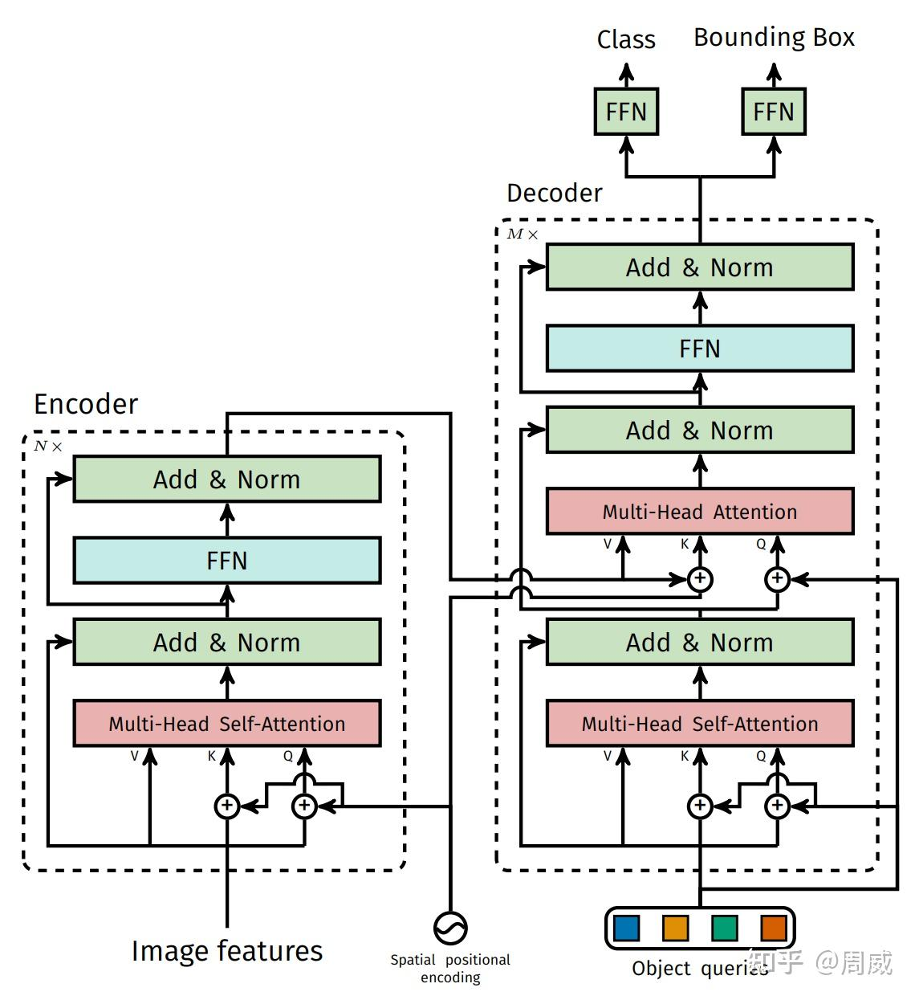

# DETR


## DETR简介

**DETR**由facebook AI团队提出，论文发表于2020年。该工作主要致力于把**Transformer**引入目标检测任务，将传统依赖**anchor**、**候选框分配**以及**NMS**后处理的检测流程，改写为端到端的集合预测问题。

DETR真正做到了End-to-End检测。在我们熟知的基于CNN的检测模型中，不论是单阶段（如YOLO），双阶段（Faster R-CNN），亦或者是无锚框设计（Anchor-free）的CenterNet，其在进行训练或者测试时，都需要人为设置一些**前处理**或者后处理操作，比如**设置锚框来提供参考**，或者**利用非极大值（NMS）抑制来筛除多余的框**。然而，DETR抛弃了几乎所有的前处理和后处理操作，使模型做到了**真正的End-to-End**；

## DETR模型结构
DETR模型主要分为两块，即**特征提取器**和**Transformer模型**。其中，**特征提取器**用于从输入图像中提取特征，**Transformer模型**用于将特征转换为检测结果。
DETR模型结构如下：

其具体的运算流程可以归纳为：
1. 输入图像$(3 * H * W)$首先经过CNN骨干网络(比如ResNet50)提取高维特征图,经过五次尺寸上的缩减每次降为原来1/2）后，输出维度为$(2048 * H /32 * W/32)$的特征图
2. 利用1x1卷积层将CNN输出的特征图的维度降低至dim(通常取256)，记做输入特征图，其维度为$(dim,H/32,W/32)$
3. 生成一个大小为 $(dim,H/32,W/32)$的位置编码，将其与输入特征图按位相加，其相加后维度依旧是$(dim,H/32,W/32)$（仍记做输入特征图）；
4. 将输入特征图reshape成$((H/32 * W /32) = seq_len,dim)$大小喂给Transformer编码器，输出同大小的特征图（记做编码器输出特征），其维度依旧是$(seq_len,dim)$
5. 构建N个（N=100），维度为256的**object queries**，其为可学习的**embeddings**，这里的100是希望模型产生至多100个物体区域。通过学习后，**object queries**和起到和**anchor**相似的作用，大致就是告诉解码器哪些区域可能会有物体；
6. 将object queries和编码器输出特征图喂给Transformer解码器，产生$(100,dim)$大小的特征输出。其中，**object queries**为第一层多头自注意力（MSA）的输入，而MSA的输出以及编码器输出的特征将作为解码器中"编码-解码"多头自注意力的输入(MSA的输出当作K和V，Encoder的输出当作Q)；
7. 利用两个并行、不共享权重的全连接层，将Transformer解码器的输出（维度为$(100,dim)$ ）映射成两个输出，一个用以分类（维度为$(100,num_classes)$ ），一个用于位置回归（维度为$(dim,4)$ ）。其中，回归的目标就是检测框归一化的中心坐标和宽高。

## 损失函数与集合度相似计算
DETR最后输出$N=100$个物体区域，但是一般图像中哪有这么多物体呢？
还有就是，网络输出为固定数量的检测框，而其对应的标签里面的物体数量是变化（假设数量为m<<N），的，这个损失如何进行计算呢？

在DETR中,DETR人为构造了一个新的物体类别"not object"，即背景类别。其补充到图像的标签中去，使得$m=N$。这就构建了两个等容量的集合了，一个记做为预测集，一个为标签集。
有了预测集和标签集后，如何计算两者之间的相似度，进而求解两者之间的损失呢？

DETR在计算相似度之前执行了最优二分图匹配，来找到预测集和标签集间各要素的最佳匹配。实现二分图匹配的算法就是匈牙利算法。


### 二分图匹配问题
二分图匹配是图论中的一个经典问题。 所谓二分图，是指图中的所有节点可以被分成两个互不相交的集合，且图中的每条边都连接两个不同集合中的节点。 而匹配，就是从这些边中选出一部分，使得任意两条被选中的边不共享同一个节点。 最大权重二分图匹配的目标是：在所有合法的匹配方案中，找到一种使得总权重最大（或总代价最小）的匹配。

举一个例子

假设有一家**婚介公司**，有 3 位男士和 3 位女士，婚介公司根据双方的兴趣、性格等给出了一个"匹配得分"（分数越高越合适）：

|      | 女A  | 女B  | 女C  |
| ---- | ---- | ---- | ---- |
| 男1  | 8    | 2    | 5    |
| 男2  | 3    | 9    | 4    |
| 男3  | 6    | 7    | 1    |

通常把上面的矩阵称之为**代价矩阵(cost matrix)**

目标：为每位男士分配一位女士（一一对应），使得**总匹配得分最大**。

这就是一个二分图匹配问题：

- **集合1**：{男1, 男2, 男3}
- **集合2**：{女A, 女B, 女C}
- **边**：每对男女之间的得分
- **匹配**：每人只能配对一次
  - 男1 → 女C（5分）
  - 男2 → 女B（9分）
  - 男3 → 女A（6分）

最大匹配总分 = 5 + 9 + 6 = **20** 

### 匈牙利算法

匈牙利算法（Hungarian Algorithm）由美国数学家 Harold Kuhn 于 1955 年提出，是解决**二分图最优匹配问题**的经典算法。在 DETR 中，它被用于在预测结果和真实目标之间找到**总代价最小**的匹配方案。

匈牙利算法的核心原理建立在一个关键定理之上：

```text
Kőnig 定理：在二分图中，最大匹配的边数 = 最小顶点覆盖的顶点数。
```

算法的巧妙之处在于：通过对代价矩阵进行**行列变换**（每行/列减去一个常数），**不改变最优匹配方案**，但能让矩阵中产生更多的 0 元素，从而更容易找到最优匹配

以一个具体的代价矩阵为例，假设有代价矩阵C，目标:找到总成本最小的分配方案：

$$ C =  \begin{bmatrix} 9 & 2 & 7 \\ 6 & 4 & 3 \\ 5 & 8 & 1 \end{bmatrix} $$

1.  **行归约**

   每行减去该行的最小值：

   - 第1行最小值 = 2，减去后：`[7, 0, 5]`
   - 第2行最小值 = 3，减去后：`[3, 1, 0]`
   - 第3行最小值 = 1，减去后：`[4, 7, 0]`

   然后得到矩阵:

   $\begin{bmatrix} 7 & 0 & 5 \\ 3 & 1 & 0 \\ 4 & 7 & 0 \end{bmatrix}$

2. **列归约**

   每列减去该列的最小值：

   - 第1列最小值 = 3，减去后：`[4, 0, 1]`
   - 第2列最小值 = 0，无需操作
   - 第3列最小值 = 0，无需操作

   然后得到矩阵

   $\begin{bmatrix} 4 & 0 & 5 \\ 0 & 1 & 0 \\ 1 & 7 & 0 \end{bmatrix}$

3. **试指派**

   在矩阵中寻找**独立 0 元素**（不同行不同列的 0）：

   - 第2行只有1个0（第1列），圈定它 → 工人2 → 任务1
   - 划去第1列其他0（无）
   - 第1行有1个0（第2列），圈定它 → 工人1 → 任务2
   - 第3行有1个0（第3列），圈定它 → 工人3 → 任务3

   找到 3 个独立 0，等于矩阵阶数 n=3，**已得到最优解**！

   如果第三步中独立 0 的数量 < n，就需要进行**矩阵调整**：

   1. 用最少的直线（横线或竖线）覆盖所有 0 元素
   2. 找到**未被覆盖区域**中的最小值 `min_val`
   3. 未被覆盖的行：每个元素减去 `min_val`
   4. 被覆盖的列：每个元素加上 `min_val`
   5. 回到第三步重新试指派

   反复迭代，直到找到 n 个独立 0 为止。

在py中，其实我们只需要计算出**代价矩阵(cost matrix)**,然后调用**from scipy.optimize import linear_sum_assignment**就可以找到最佳的二分图匹配。

`linear_sum_assignment` 是 SciPy 中用于求解**线性分配问题**（也称最小权重二分图匹配）的函数，底层实现基于**匈牙利算法**（改进的 Jonker-Volgenant 算法）。

函数参数列表如下

| 参数          | 类型       | 默认值  | 说明                                                         |
| ------------- | ---------- | ------- | ------------------------------------------------------------ |
| `cost_matrix` | array-like | 必填    | 二分图的代价矩阵（cost matrix），`cost_matrix[i, j]` 表示将第 i 个"工人"分配给第 j 个"任务"的代价 |
| `maximize`    | bool       | `False` | 若为 `True`，则求解最大权重匹配（即总代价最大）；若为 `False`，则求解最小权重匹配（总代价最小） |

返回值:

返回一个元组 `(row_ind, col_ind)`：

- **`row_ind`**：行索引数组（已排序），表示被匹配的"工人"编号
- **`col_ind`**：列索引数组，表示每个"工人"被分配到的"任务"编号

最优分配的总代价可通过 `cost_matrix[row_ind, col_ind].sum()` 计算。


### DETR损失计算

要实现最终用于DETR训练的损失计算，需要的步骤就是**1. 求解代价矩阵—>2. 匈牙利算法求最优匹配—>3. 根据匹配计算损失**。

#### DETR代价矩阵求解

匹配的核心就在于如何去计算两个集合间各要素的**代价（cost）**,用于衡量**每个预测框与每个真实框之间的匹配代价**

DETR 匈牙利匹配所用的两两匹配代价矩阵，匹配代价（matching cost）同时考虑了**类别预测**和**预测框与真实框的相似度**。

真实标签集合中的每个元素 $y_i$表示为$(c_i,b_i)$，其中:

- $c_i$是目标类别标签（可以是空类 ∅，用于填充背景）。

- $b_i$是一个四维向量，取值在 [0,1] 内，表示真实框的**中心坐标 (x, y)** 以及**高度和宽度**，这些值都是相对于图像尺寸归一化后的（即 0~1 之间）。

  这个元素对应的预测集的索引设为$j$,则其s对应的预测集设置为$\hat{y}_{j}$,则将第j个预测分配给第i个目标的代价为:
  $$
  cost(i,j) = \mathbf{-1}_{\{c_i \neq \emptyset\}} \hat{p}_{j}(c_i) + \mathbf{1}_{\{c_i \neq \emptyset\}} L_{\text{box}}(b_i, \hat{b}_j)
  $$

  1. **$\mathbf{-1}_{\{c_i \neq \emptyset\}} \hat{p}_{j}(c_i)$（分类代价）**：

     首先我们可以发现，计算cost(i,j)的前提是，$c_i \neq \emptyset$ 。所以当标签类为背景时，其对应的所有cost都是0

     $\hat{p}_j(c_i)$表示第$j$个预测输出的pred_class(shape =$[B,num\_classes+1]$)经过softmax后，表示$c_i$这个类别的概率

  2. $\mathbf{1}_{\{c_i \neq \emptyset\}} L_{\text{box}}(b_i, b_{j})$**(回归框代价)**

     DETR的回归框代价和DETR的回归框损失是一样的，都是由L1和GIou组成，框代价定义为：
     $$
     L_{box}(b_i,\hat{b}_j) = \lambda_{L1}L_{L1}(b_i,\hat{b}_j) + \lambda_{giou}L_{giou}(b_i,\hat{b}_j)
     $$

     $$
     L_{L1}(b_i,\hat{b}_j) = \abs{cx_i - cx_j} + \abs{cy_i - cy_j} + \abs{h_i - h_j} +\abs{w_i - w_j}
     $$

  3. 

  #### DETR损失函数计算

  上一步求出DETR的代价矩阵后，可以通过调用**from scipy.optimize import linear_sum_assignment**就可以找到最佳的二分图匹配。假设真实标签索引$i$所对应的预测集中的最佳匹配索引为$\sigma(i)$,则定义他们俩之间的损失为:
  $$
  L(i,\sigma(i)) =  \sum_{i=1}^N [-log\hat{p}_{\sigma(i)}(c_i)  + \mathbf{1}_{\{c_i \neq \emptyset\}} L_{\text{box}}(b_i, b_{\sigma(i)})]
  $$
  **在实践中,我们将 $c_i = \emptyset$ 时的对数概率项的权重降低 10 倍以考虑类别失衡**

  

  

## 相关细节

### 位置编码

由于Transformer对各个输入的位置是不敏感的，因此需要通过位置编码(pos)来提供位置信息
一般来说，为了让Transformer了解各输入间的位置关系，在输入Transformer之前需要为每个特征嵌入相应的位置信息。
这种位置信息嵌入方式主要有两种，**其一是为每个输入手动计算相应的位置编码，其二是设置可学习的位置编码。**
在DETR的代码实现中，作者也提供了两种位置编码选择
其一是手动计算的二维正弦位置编码（2D Sinusoidal Positional Encoding）
```python
import torch
import torch.nn as nn
import math
class PositionEmbeddingSine(nn.Module):
    """
    二维正弦位置编码模块
    这是Transformer原始位置编码在图像上的推广版本，用于为图像特征图添加空间位置信息。
    参考自 DETR 官方实现：https://github.com/facebookresearch/detr
    """
    def __init__(self, num_pos_feats=64, temperature=10000, normalize=False, scale=None):
        """
        初始化位置编码模块
        
        Args:
            num_pos_feats: 每个维度（行或列）的位置编码特征数，通常为 hidden_dim // 2
            temperature: 温度参数，控制编码频率的分布，默认为10000（与Transformer一致）
            normalize: 是否将坐标归一化到 [0, scale] 范围
            scale: 归一化时的缩放因子，默认为 2π
        """
        super().__init__()
        self.num_pos_feats = num_pos_feats  # 每个方向（行/列）的编码维度
        self.temperature = temperature      # 温度参数
        self.normalize = normalize          # 是否归一化坐标
        # 如果传入了 scale 但 normalize 为 False，则报错
        if scale is not None and normalize is False:
            raise ValueError("normalize should be True if scale is passed")
        # 如果 scale 未指定，默认使用 2π（使坐标在 [0, 2π] 范围内）
        if scale is None:
            scale = 2 * math.pi
        self.scale = scale

    def forward(self, tensor_list: NestedTensor):
        """
        前向传播：生成二维位置编码
        
        Args:
            tensor_list: NestedTensor 对象，包含：
                - tensors: 图像特征图 [batch_size, channels, height, width]
                - mask: 填充掩码 [batch_size, height, width]，True 表示填充位置，False 表示有效位置
        
        Returns:
            pos: 位置编码 [batch_size, 2*num_pos_feats, height, width]
                 可以直接与特征图相加
        """
        # 1. 提取特征图和掩码
        x = tensor_list.tensors           # [B, C, H, W] 图像特征
        mask = tensor_list.mask           # [B, H, W] 填充掩码，True=填充区域，False=有效区域
        assert mask is not None           # 确保 mask 存在
        not_mask = ~mask                  # [B, H, W] 取反，True=有效区域，False=填充区域
        
        # 2. 生成坐标网格
        # y_embed: 在高度方向（dim=1）累加，得到每个像素的行坐标（从1开始）
        # 例如 3x3 特征图：[[1,1,1], [2,2,2], [3,3,3]]
        y_embed = not_mask.cumsum(1, dtype=torch.float32)  # [B, H, W]
        
        # x_embed: 在宽度方向（dim=2）累加，得到每个像素的列坐标（从1开始）
        # 例如 3x3 特征图：[[1,2,3], [1,2,3], [1,2,3]]
        x_embed = not_mask.cumsum(2, dtype=torch.float32)  # [B, H, W]
        
        # 3. 坐标归一化（可选）
        if self.normalize:
            eps = 1e-6  # 防止除零
            # y_embed[:, -1:, :] 取每张图最后一行（最大值），将行坐标归一化到 [0, scale]
            y_embed = y_embed / (y_embed[:, -1:, :] + eps) * self.scale
            # x_embed[:, :, -1:] 取每张图最后一列（最大值），将列坐标归一化到 [0, scale]
            x_embed = x_embed / (x_embed[:, :, -1:] + eps) * self.scale
        
        # 4. 计算频率维度
        # 生成 0 到 num_pos_feats-1 的索引
        dim_t = torch.arange(self.num_pos_feats, dtype=torch.float32, device=x.device)
        # 计算频率：temperature^(2*i/num_pos_feats)
        # 对于 i=0,1,2,3,... 得到 [1, 100^(2/num), 100^(4/num), ...]
        # 其中 dim_t // 2 使得奇偶索引共享相同的频率（偶数用sin，奇数用cos）
        dim_t = self.temperature ** (2 * (dim_t // 2) / self.num_pos_feats)
        
        # 5. 应用正弦和余弦编码
        # 将坐标扩展维度并除以频率：x_embed[:, :, :, None] -> [B, H, W, 1]
        # dim_t -> [num_pos_feats]，广播除法得到 [B, H, W, num_pos_feats]
        pos_x = x_embed[:, :, :, None] / dim_t  # [B, H, W, num_pos_feats]
        pos_y = y_embed[:, :, :, None] / dim_t  # [B, H, W, num_pos_feats]
        
        # pos_x[:, :, :, 0::2] 取偶数索引，应用 sin；1::2 取奇数索引，应用 cos
        # stack 后在 dim=4 拼接，然后 flatten(3) 将最后两维合并
        # 最终 pos_x 形状: [B, H, W, num_pos_feats]
        pos_x = torch.stack(
            (pos_x[:, :, :, 0::2].sin(), pos_x[:, :, :, 1::2].cos()), 
            dim=4
        ).flatten(3)  # [B, H, W, num_pos_feats]
        
        # 同样处理 y 方向
        pos_y = torch.stack(
            (pos_y[:, :, :, 0::2].sin(), pos_y[:, :, :, 1::2].cos()), 
            dim=4
        ).flatten(3)  # [B, H, W, num_pos_feats]
        
        # 6. 拼接行列编码并调整维度
        # 将行编码和列编码在特征维度（dim=3）上拼接
        # 得到 [B, H, W, 2*num_pos_feats]
        pos = torch.cat((pos_y, pos_x), dim=3)
        
        # permute(0, 3, 1, 2) 调整维度顺序为 [B, 2*num_pos_feats, H, W]
        # 这样可以直接与特征图相加（特征图形状为 [B, C, H, W]）
        pos = pos.permute(0, 3, 1, 2)
        
        return pos
```

其二是自动学习的位置编码方式，其代码实现如下所示：
```python
import torch
import torch.nn as nn

class PositionEmbeddingLearned(nn.Module):
    """
    可学习的绝对位置编码模块（Learned Absolute Position Embedding）
    
    与固定正弦编码不同，本模块使用可训练的参数来学习位置编码。
    每个位置（行或列）都有一个独立的可学习向量，通过训练不断优化。
    
    优点：
    - 灵活性高，可以自适应数据分布
    - 可能学到比固定编码更优的表示
    
    缺点：
    - 需要额外参数量
    - 受限于预设最大尺寸（50x50），无法外推到更大尺寸
    """
    def __init__(self, num_pos_feats=256):
        """
        初始化可学习位置编码模块
        
        Args:
            num_pos_feats: 每个方向（行或列）的位置编码维度
                          注意：这里 num_pos_feats 是完整维度（如256），
                          与正弦编码中的 num_pos_feats（一半维度）不同
        """
        super().__init__()
        
        # 创建行位置嵌入表：50行，每行 num_pos_feats 维
        # nn.Embedding(50, num_pos_feats) 创建一个形状为 [50, num_pos_feats] 的可训练参数矩阵
        # 行索引 0~49 分别对应第0行到第49行的位置编码
        self.row_embed = nn.Embedding(50, num_pos_feats)
        
        # 创建列位置嵌入表：50列，每列 num_pos_feats 维
        # 列索引 0~49 分别对应第0列到第49列的位置编码
        self.col_embed = nn.Embedding(50, num_pos_feats)
        
        # 初始化参数
        self.reset_parameters()

    def reset_parameters(self):
        """
        初始化位置编码参数
        使用均匀分布初始化，范围默认在 [0, 1) 之间
        """
        # 对行嵌入表的权重进行均匀分布初始化
        # nn.init.uniform_ 默认范围是 [0, 1)
        nn.init.uniform_(self.row_embed.weight)
        # 对列嵌入表的权重进行均匀分布初始化
        nn.init.uniform_(self.col_embed.weight)

    def forward(self, tensor_list: NestedTensor):
        """
        前向传播：生成可学习的二维位置编码
        
        Args:
            tensor_list: NestedTensor 对象，包含：
                - tensors: 图像特征图 [batch_size, channels, height, width]
                - mask: 填充掩码 [batch_size, height, width]
        
        Returns:
            pos: 位置编码 [batch_size, 2*num_pos_feats, height, width]
                 可直接与特征图相加
        """
        # 1. 提取特征图并获取尺寸
        x = tensor_list.tensors  # [B, C, H, W]
        h, w = x.shape[-2:]      # 获取高度 H 和宽度 W
        
        # 2. 生成列索引和行索引
        # i: 0, 1, 2, ..., w-1  (列索引)
        i = torch.arange(w, device=x.device)  # [w]
        # j: 0, 1, 2, ..., h-1  (行索引)
        j = torch.arange(h, device=x.device)  # [h]
        
        # 3. 通过嵌入表获取位置编码
        # col_embed(i): 获取第0到w-1列的编码 -> [w, num_pos_feats]
        x_emb = self.col_embed(i)  # [w, num_pos_feats]
        # row_embed(j): 获取第0到h-1行的编码 -> [h, num_pos_feats]
        y_emb = self.row_embed(j)  # [h, num_pos_feats]
        
        # 4. 扩展并拼接行列编码
        # 目标：生成 [h, w, 2*num_pos_feats] 的完整位置编码矩阵
        
        # x_emb.unsqueeze(0)      -> [1, w, num_pos_feats]
        # .repeat(h, 1, 1)        -> [h, w, num_pos_feats]
        # 作用：将列编码在行方向重复 h 次，使得每个像素位置都获得该列的编码
        col_emb_expanded = x_emb.unsqueeze(0).repeat(h, 1, 1)  # [h, w, num_pos_feats]
        
        # y_emb.unsqueeze(1)      -> [h, 1, num_pos_feats]
        # .repeat(1, w, 1)        -> [h, w, num_pos_feats]
        # 作用：将行编码在列方向重复 w 次，使得每个像素位置都获得该行的编码
        row_emb_expanded = y_emb.unsqueeze(1).repeat(1, w, 1)  # [h, w, num_pos_feats]
        
        # 在最后一个维度（特征维度）上拼接行编码和列编码
        # cat([列编码, 行编码], dim=-1) -> [h, w, 2*num_pos_feats]
        pos = torch.cat([col_emb_expanded, row_emb_expanded], dim=-1)  # [h, w, 2*num_pos_feats]
        
        # 5. 调整维度顺序并扩展到 batch 维度
        
        # permute(2, 0, 1)         -> [2*num_pos_feats, h, w]
        # 将特征维度移到最前面，与特征图的 [C, H, W] 格式对齐
        pos = pos.permute(2, 0, 1)  # [2*num_pos_feats, h, w]
        
        # unsqueeze(0)             -> [1, 2*num_pos_feats, h, w]
        # repeat(x.shape[0], 1, 1, 1) -> [B, 2*num_pos_feats, h, w]
        # 在 batch 维度上复制，使得每个样本都有相同的位置编码
        pos = pos.unsqueeze(0).repeat(x.shape[0], 1, 1, 1)  # [B, 2*num_pos_feats, h, w]
        
        return pos
```

可见DETR中使用的可训练位置编码与VIT中使用的可训练位置编码不同，VIT中的可训练位置编码仅仅一行代码实现:
```python
self.pos_embedding = nn.Parameter(torch.randn(1, num_patches + 1, dim)) # 可学习的参数，长度为图像块数量+1，这里的1是class token
```

在Transformer原始论文中，位置编码不仅需要在编码器输入前添加，还需要在解码器输入前添加。
**但在DETR中，由于解码器的输入是object queries，而不是图像块，因此不需要在解码器输入前添加位置编码。**

