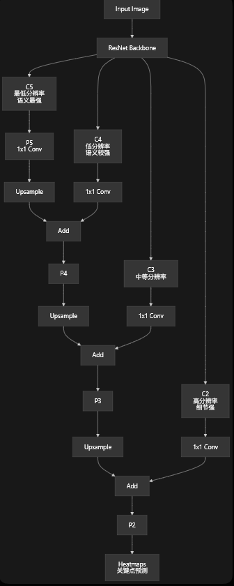
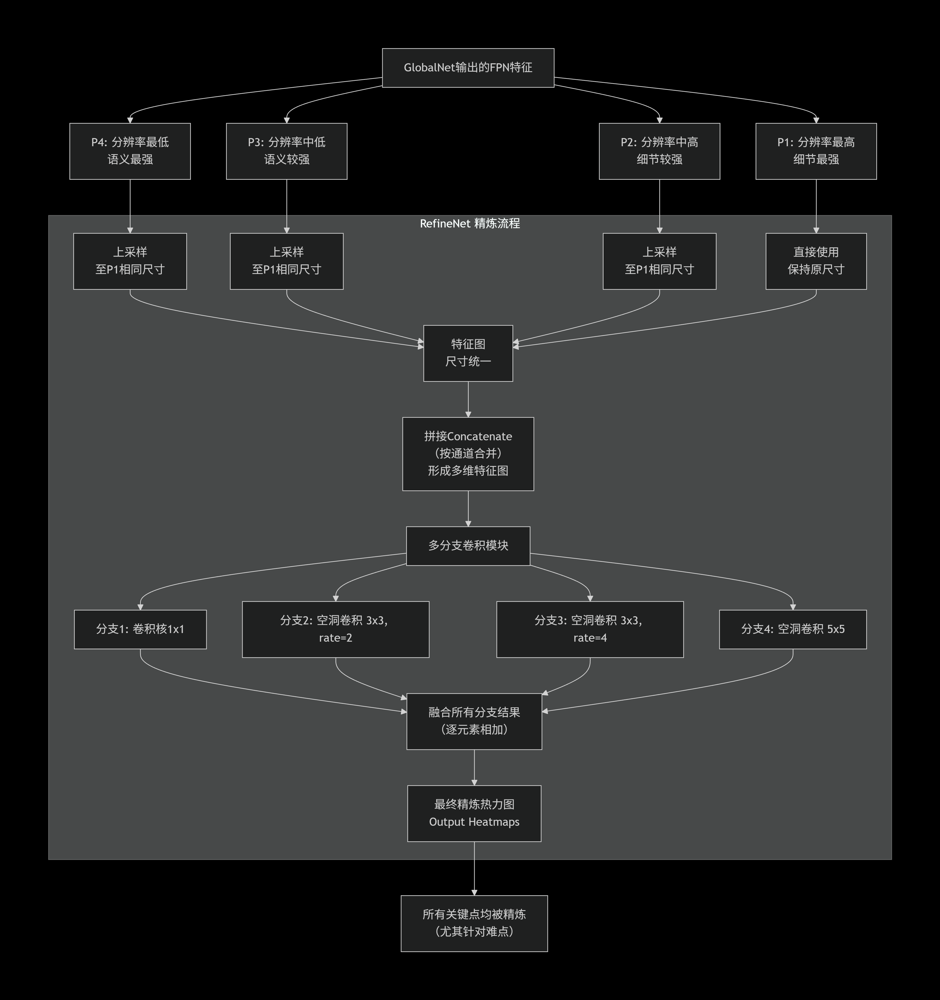
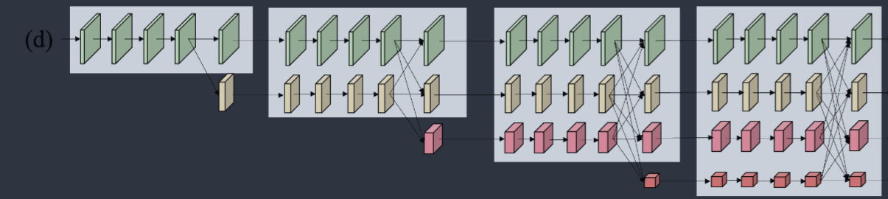

# PoseEstimation

体姿势估计旨在定位输入数据(例如图像、视频 或信号)中的人体解剖关键点或身体部位。它是使机器能够深入理解人类行为的关键组成部分,并已成为计算机视觉及相关领域的一个突出问题。
现阶段优化方法: **网络架构设计**、**网络训练细化**和**后处理**。


## 1. 网络架构设计方法

 对于PoseEstimation，网络架构设计的方法通常采用两种通用框架:**自上而下的框架**和**自下而上的框架**。


### 1.1 自上而下范式
 自上而下的范式通常先检测人体边界框，然后对每个边界框执行单人姿势估计。自上而下的范式可以进一步划分为
 **基于回归的**、**基于热力图的**、**基于视频的**和**基于模型压缩的**方法。

自顶向下框架的架构包括以下关键组件:用于生成人体边界框的对象检测器(如YOLO)和用于检测人体关键点位置的姿态估计器(如HRNet)。目标检测器决定了人体提案检测的性能, 并进一步影响姿势估计。另一方面,姿态检测器是框架的核心,直接决定姿态估计的准确性。总之,自上而下的框架具有高度可扩展性,可以随着对象检测器和姿势检测器的进步而不断改进。

如下图所示:


(SPPE是Single-Person Pose Estimator，即单人姿势估计器)

 #### 1.1.1 基于回归的方法 
 基于回归的方法**最开始尝试直接通过端到端的网络学习直接回归关键点的坐标位置。**


 ##### 1.1.1.1 基本坐标回归
 例如DeepPose就是一种基于坐标回归方法的网络架构。它以AlexNet作为backbone提取图像特征，然后使用全连接层回归关键点坐标。 
 例如输入张量为$(batch,C,H,W)$,若有$K$个关键点，则输出张量为$(batch,2*K)$。这$2*K$个数值按顺序排列，就是 $[x_1, y_1, x_2, y_2, ..., x_K, y_K]$,表示$K$个关键点的坐标。

 ##### 1.1.1.2 结构感知回归
 接着有学者提出了一种也是基于回归的自校正模型(self-correcting model),可以称为结构感知回归。


 #### 1.1.2 基于热力图的方法
基于热力图的方法是目前广泛采用的。
这种方法不直接预测关键点坐标，而是预测每个关键点在图像中的概率分布。(注：姿态估计中的 Heatmap 严格来说并不是概率分布（Probability Distribution），而是概率密度响应图（Confidence Map / Likelihood Map）。论文中习惯称它为 Heatmap，但它通常没有经过归一化，因此所有值的和并不等于1。)
例如输入张量为$[batch, C, H, W]$,若有$K$个关键点，则输出张量为$[batch, K, H_m, W_m]$。这张概率图上每个像素的值表示“这个像素是关节”的概率。$H_m$和$W_m$是热力图的高度和宽度，通常比原图小。

疑问:为什么热力图的尺寸比原图小?
答:因为热力图的尺寸比原图小，所以可以减少计算量。例如原图尺寸为$256*192$，热力图尺寸为$64*48$，可以看到$64/256=1/4$，$48/192=1/4$，热力图的尺寸是原图的$1/4$。说明Heatmap上的一个像素对应原图上的4×4个像素区域。若Heatmap预测$(30,21)$点某个关键点概率为$0.9$,则原图上的对应位置$(30*4,21*4)=(120,84)$的概率为$0.9$。实际上，大多数论文不会直接乘4还原到原图坐标点，因为这样会产生**量化误差（Quantization Error）**。


热力图(Heatmap)通常直接由二维高斯函数生成:
$$
H(x,y) = \exp\left(-\frac{(x-x_0)^2 + (y-y_0)^2}{2\sigma^2}\right)
$$

其中：

- $H(x,y)$：热力图中坐标$(x,y)$的值。
- $(x_0,y_0)$：热力图中的关键点（Ground Truth）的峰值坐标。峰值坐标由原图中关键点的坐标除以原图与热力图的缩放比例得到。例如原图大小为$256 × 256$,热力图大小为$64 × 64$,缩放比例为4，如果一个关键点在原图中的坐标为$(100, 120)$,则该关键点在热力图中对应的峰值坐标为$（25,30）$,即$x_0 = 25 , y_0 =30$
- $\sigma$：高斯核的标准差，控制热力图扩散范围。**$\sigma$（标准差）没有固定值，而是一个超参数（Hyperparameter）**，需要根据**热力图分辨率**和**数据集**来选择。但通常热力图都会在数据集中给出了，并不自己要手动去设置。
- $(x,y)$：热力图上的任意一个像素坐标。

注意这里**没有任何归一化操作**。

因此：

- 峰值固定为1；
- 离中心越远值越小；
- **并不要求所有值加起来等于1。**

例如：

0 0.1 0.2

0.4 0.8 1.0

0.3 0.6 0.9

代表性的基于热力图方法的架构有 **Iterative Architecture（迭代架构）、Symmetric Architecture（对称架构）、Asymmetric Architecture（非对称架构）、High Resolution Architecture（高分辨率架构）**。

##### 1.1.2.1 Iterative Architecture（迭代架构）
它的核心思想可以概括为一句话：**第一次预测只是一个粗略结果，然后不断利用前一次预测结果进行修正（Refinement），最终得到更加准确的关键点位置。**

这是对“迭代架构”核心思想的概括。它不像现代网络“一步到位”地预测关键点，而是采用**“粗估计 → 反复修正”**的策略。首先生成一张粗糙的热图（初步猜测关节在哪），然后通过多个阶段（Stage）逐步优化，让热图越来越精确。

**Ramakrishna V, Munoz D, Hebert M, Bagnell JA,  Sheikh Y (2014) Pose machines: Articulated pose estimation via inference machines.**是早期代表作。它使用多个串联的预测模块，后一个模块会参考前一个模块的预测结果，从而在空间上逐步“聚焦”到正确的关节位置。

**Wei SE, Ramakrishna V, Kanade T, Sheikh Y (2016)  Convolutional pose machines. In: Proceedings of the IEEE Conference on Computer Vision and Pattern Recognition (CVPR)** 在上文基础上做了关键升级：用卷积神经网络（CNN）替换了之前的模型。更重要的是，**CPM(卷积姿势器)**通过增大感受野（Receptive Field），让网络在预测手腕时，能“看到”肩膀甚至胯部的位置，从而隐式地学习了人体骨架的几何约束（比如手腕通常不会长在膝盖上）。
CMP还提出了**中间监督**来缓解迭代架构中梯度消失的固有问题。这是CPM的一个关键技术。因为网络有多个阶段（很深），梯度在反向传播时容易衰减（Vanishing Gradient），导致浅层网络学不到东西。中间监督是指在每个阶段的输出端都计算一次损失（Loss），强制让每一层都接收到有效的梯度信号，确保每一阶段都在“认真工作”。
具体来说中间监督”指的是 CPM 里的 **stage-wise auxiliary loss（阶段式辅助损失）**，不是只监督最后输出，而是每个阶段都单独加损失。
具体做法是:

- 每一阶段都会输出一组 **belief maps**，也就是每个关节的热图预测。
- 用由真实关节位置生成的 Gaussian 目标热图作为监督信号。
- 对每个阶段的预测热图和目标热图计算 L2 loss。
- 把所有阶段的损失相加，作为总损失一起端到端训练。

CMP的论文中提到用于实现这个**stage-wise auxiliary loss（阶段式辅助损失）**的具体落地实现方案是在每个 stage 后面都有一个 **intermediate loss layer（中间损失层）**，但要注意，它本身不是一个可学习的网络层，而是每个 stage 后面挂的一个监督分支。

多阶段具体网络结构如下图所示：

- **Feature Maps**：指的是卷积网络提取出来的中间特征图，也就是 image encoder / CNN backbone 输出的空间特征表示，不是标签。
- **HeatMap**：图里这个通常指的是模型当前阶段预测出来的 heatmap / belief maps，也就是上一阶段输出、传给下一阶段继续细化的那一份。

**stage-wise auxiliary loss** 具体网络如下图所示：


但尽管**stage-wise auxiliary loss（阶段式辅助损失）** 缓解了多阶段模型的梯度消失问题，但每个阶段仍然无法构建深层子网络来提取有效的语义特征，这极大地限制了它们的拟合能力。

但随着ResNet出现，它允许梯度通过“高速公路”直接传回浅层，从而支持训练上百层的深度网络。有了深度，网络就能提取更丰富、更抽象的语义特征。受益于这种方式，许多大型模型被设计出来，极大地促进了二维HPE的进程。

##### 1.1.2.2 Symmetric Architecture（对称架构）
对称架构深度模型通常采用从高到低(下采样，Encoder)和从低到高（上采样，Decoder）的框架，类似于**UNet**。
例如**Newell A, Yang K, Deng J (2016) Stacked hourglass  networks for human pose estimation. In: European conference on computer vision, Springer** 提出一种 **Stacked Hourglass Network (堆叠沙漏网络)**
简单来说一个 **hourglass** 就类似一个小的**UNet**

- 先把图像特征不断下采样，获得大范围上下文信息  
- 再上采样回去，恢复关节定位所需的空间精度  
- 中间通过跳连把浅层细节和深层语义融合起来  
- 一个 **hourglass** 结束后，还可以再接一个 **hourglass** 继续 refine

一个 **hourglass** 的结构图就如下图所示:

**Stacked** 表示不是一个 **hourglass** 就结束，而是多个 **hourglass** 串起来：


- 第 1 个 hourglass 先粗略找到关节
- 第 2 个 hourglass 继续修正
- 第 3 个 hourglass 再进一步细化

所以它本质上是一个逐步 **refinement** 的过程。

##### 1.1.2.3 Asymmetric Architecture(非对称结构)
非对称性架构是指`high-to-low process is heavy` 和 `low-to-high process is light`。
`high-to-low process is heavy`：从高分辨率图像到低分辨率特征图这一步很重，通常用 VGGNet、ResNet 这类分类网络 backbone，负责提取强语义特征。
`low-to-high process is light`：从低分辨率特征恢复到高分辨率 heatmap 这一步比较轻，只用少量上采样或转置卷积。

**Cascaded Pyramid Network for Multi-Person Pose Estimation** 提出的 **CPN（Cascaded Pyramid Network，级联金字塔网络）** 就是一个典型的非对称架构。
其模型的架构如下图所示：


GlobalNet是第一部分，这个部分先用 ResNet 作为backbone,从输入图像中图区出不同层级的特征图，然后通过FPN（特征金字塔）进行特征融合,最后输出组略热图,如下图所示：


- `C2, C3, C4, C5`：来自 ResNet 不同阶段的特征。
- `C5`：分辨率最低，但人体整体语义最强，比如能判断“这是一个人、身体大概朝向如何”。
- `C2`：分辨率最高，保留更多边缘、轮廓、局部细节。
- `1x1 Conv`：把不同层的通道数统一，方便后面相加。
- `Upsample`：把深层低分辨率特征放大到上一层的分辨率。通常采用双线性插值。
- `Add`：把上采样后的深层语义特征和当前层的浅层空间特征融合。
- `P2, P3, P4, P5`：融合后的金字塔特征。为后面的 RefineNet 提供多层特征

RefineNet



##### 1.1.2.4 High Resolution Architecture(高分辨率架构)
高分辨率架构与以前的模型不同，最具代表的高分辨率模型是**HRNet**。它能在整个过程中保持高分辨率表示，并进行重复的多尺度融合，每个分辨率特征都从所有分辨率接收丰富的信息。
后来广泛的研究都是基于**HRNet**为**backbone**,进一步结合门控机制和特征注意模块来选择和融合判别性和 注意感知特征。

#### 1.1.3 基于视频的方法

大多数现在有方法在静态图像上进行训练的。直接将基于图像的模型应用于视频(图像序列)，可能会导致不令人满意的结果,因为它们未能 考虑视频帧之间的时间一致性。为了克服这一困境, 许多方法已经探索利用**附加时间信息**来实现更高的姿态检测精度。
如何利用时间这个信息呢，目前主要有四种方法:**基于光流的、基于RNN的、基于姿势跟踪的和基于关键帧的范式**
##### 1.1.3.1 基于光流的范式
##### 1.1.3.2 基于RNN的范式

 LSTM姿态机（LSTM Pose Machines）的核心思想，是将原本用于单张图片的**卷积姿态机（CPM）**，改造为一个能处理视频的**循环神经网络（RNN）**。它通过在网络中引入**长短期记忆（LSTM）单元**，让模型能够利用视频帧之间的时序信息，从而提升姿态估计的稳定性和准确性。

原始的CPM通过**多个阶段（Stages）** 迭代地精炼关键点热力图。每一阶段都接收上一阶段的预测结果和图像特征，从而逐步提升定位精度。如果让CPM的多个阶段**共享网络权重**，那么这些阶段在结构上就等同于一个RNN按时间步展开。于是，一个原本用于处理单张图片的“深度”网络，就变成了一个能处理**视频帧序列**的“循环”网络。这样，不同“阶段”处理的不再是同一张图片，而是视频中**连续的视频帧**。

 
图中黄色块和蓝色块分别代表每个阶段的特征图和预测热力图

黄色是**中心图（Center Map）**，是一张与热力图（Heatmap）尺寸相同的二维图像，它是一张数学生成的、而非网络学到的特征图。

它的生成方式很简单：

- **定义峰值**：在人体躯干中心（通常是头、颈或骨盆区域的中心点）位置，设置一个高斯峰值。
- **形成分布**：从峰值向外扩散，数值按高斯函数逐渐衰减到0。

简单来说，**Center Map看起来就像一张只有一个“亮斑”的黑白图，亮斑的中心就是人的大致位置**。
##### 1.1.3.3 姿态跟踪
### 1.2 自下而上的范式
自下而上和自上而下框架之间的主要差异在于是**否采用人体检测器来检测人体边界框**。
自下而上的方法不依赖于人类检测,直接在原 始图像中进行关键点估计。,从而减少了计算开销。然 而,这个过程提出了一个新的挑战:如何判断估计关 节的身份？
根据确定关键点身份的方式，我们将自下而上的发放分为**基于人类中心回归的(human center regression-based)、基于关联嵌入的(associate embeddingbased)和基于部分字段(part field-based)的方法** 。

#### 1.2.1 基于人类中心回归的
基于人类中心回归的方法通常采用**回归方法**来预测人体的中心位置，然后根据中心位置和关键点位置之间的关系来预测关键点位置。这种方法的关键在于如何定义和计算中心位置和关键点位置之间的关系。常见的计算方法包括使用关键点之间的距离、角度等几何特征，或者使用关键点之间的相对位置关系。这些方法通常需要大量的训练数据，并且对训练数据的标注质量要求较高。

#### 1.2.2 基于关联嵌入的
#### 1.2.3 基于部分字段的


## 2. 网络训练细化
从神经网络整体训练流程的角度来看,数据的数量 和质量、训练策略和损失函数都会影响模型的性能。根 据训练过程中的上述关键阶段,我们将网络训练细化方法分为数据增强技术、多任务训练策略、损失函数约束和领域适应方法。

### 2.1 数据增强技术
在二维人体姿势估计中，常用的数据增强技术包括随机旋转、随机缩放、随机截断、水平翻转、随机信息丢弃和光照变化等等。


### 2.2 多任务训练策略
多任务学习旨在通过在相关视觉任务之间共享表示来捕获信息特征。
例如，人体解析是人体姿势估计密切相关的任务，其目标是将人体分割为头部、手臂和腿等语义信息。
因为，可以利用人体解析信息来提高2D HPE的性能。也可以联合人体解析和姿势估计两个任务，利用部分片段来指导关键点定位。

### 2.3 损失函数约束
#### 2.3.1 常见L2损失函数
2D HPE 中最常见的损失函数就是L2距离。
$$
L = \frac{1}{N} * \sum_{j=1} ^N {v_j} * || G(j) - P(j)|| ^ 2
$$
其中 $G(j)$、$P(j)$ 和 $v_j$ 分别表示关节 $j$ 的真实热图、预 测热图和可见性。符号$N$表示关节的数量。

#### 2.3.2 多尺度人体结构感知损失（multi-scale human structure-aware loss）
在人体姿态检测任务中，模型通常会在多个分辨率下预测热力图(如HRNet中的四个阶段)，那么每个分辨率下都可以计算出一个损失
假设用$i$代表第$i$个特征尺度。这个损失通常被称为**PDLoss (概率分布损失)**，公式为
$$
L^i_{pd} = \frac {1}{N} \sum_{j=1}^N {v_j} * ||{P_j}^i - {G_j}^i|| ^ 2
$$

那要如何用损失函数捕获人体的结构信息呢？
我们可以为每一个关键点都设置一些**结构邻居**，设为$S(j)$。例如左肘的结构邻居设置为左肩, 左手腕，那么$S(j)$就为{左肩, 左手腕}。
那么对于第$i$个特征尺度，它的**结构损失（struct loss,STLoss）**就可以定义为
$$
L^i_{st} = \frac {1}{N} \sum_{j=1}^N \sum_{k \in S(j)} {v_k} * ||{P_k}^i - {G_k}^i|| ^ 2
$$

最后将这两损失按一定权重$\alpha$相加，得到最后的**多尺度人体结构感知损失（multi-scale human structure-aware loss）**
$$
L^i = \frac{1}{N} ( \sum_{j=1}^N {v_j} * ||{P_j}^i - {G_j}^i|| ^ 2 +  \alpha * \sum_{j=1}^N \sum_{k \in S(j)} {v_k} * ||{P_k}^i - {G_k}^i|| ^ 2)
$$

这种损失函数**在标准的逐点热力图监督之上，增加了基于人体骨架结构关系的额外监督项，强制模型在学习定位每个关键点的同时，也学习它们之间的几何约束。**
#### 2.3.2 combined distillation loss（组合蒸馏损失,CDL）
这种损失是一种为HRNet量身定制的**组合蒸馏损失（Combined Distillation Loss）**
这个组合蒸馏损失的核心思想，是通过知识蒸馏技术，将复杂模型（或模型自身深层）的“知识”迁移给学生网络，以提升其性能。具体到HRNet，这三个损失函数分别发挥了以下作用：
- **STLoss(结构损失)**:用于应对姿态遮挡问题。它强制网络在学习早期就关注人体各关键点之间的内在结构性关系（例如，手腕和手肘的相对位置），帮助模型在部分关键点被遮挡时，能利用这种结构知识来推断其位置，而不是孤立地预测每个点。
- **PairLoss (成对抑制损失)**：旨在缓解拥挤场景下相似关节的错误分类。在多人或拥挤场景中，模型很容易将一个人的关节误判给另一个人。PairLoss通过抑制不匹配的关键点对（pair）之间的响应，来减少这种混淆，帮助模型更准确地将关键点分配给正确的人体。
- **PDLoss (概率分布损失)**：用于指导最终热力图的分布学习。通常，知识蒸馏会让学生网络的热力图分布去模仿教师网络的。但这里可能更进一步，它不仅仅关注热力图中最大值的位置（即关键点坐标），还关注整个概率分布的形状，从而让学生网络学到更丰富的、关于预测不确定性的信息。

## 3. 后处理方法
些方法不是立即预测最终关键点位置,而是首先估 计初始姿态,然后通过一些后处理操作对其进行优化, 我们将其称为后处理方法。我们将这些方法分为两类, 即量化误差和姿态重采样。

### 3.1 量化误差
对于关键点的热图表示, 从热图到坐标空间的转换不可避免地会出现错误,从而导致量化误差。抑制此类量化误差将提高许多基于热图的模型的性能。

## 4. 数据集
### 4.1 Leeds Sports Pose (LSP) Dataset 
LSP 数据集总共包含2000张全身姿势图像(包括 14 个关节),分别用于 训练和测试的 1,000 张图像。该数据库是从 Flickr4 中标 记为田径、羽毛球、棒球、体操、跑酷、足球、网球和排 球的图像中收集的。 LSP 数据集随后扩展为 LSP 扩展数 据集,其中包含超过 10000 个训练图像。数据集已在 https://sam.johnson.io/research/lsp.html 上公开提供。

### 4.2 Frames Labeled in Cinema (FLIC) Dataset
FLIC 数据集由大约 5,000 张取自流行好莱坞电影的图像组成,其中 4,000 张 图像用于训练,1,000 张图像用于测试。这些数据集已在 https://bensapp. github.io/flic-dataset.html 上公开提供。 

### 4.3 MPII Human Pose Dataset
MPII 人体姿势数据集 MPII 数据集包含 28、 821 个用于训练的图像和 11,701 个用于测试的图像。 该数据集涵盖了各种人类活动,包括娱乐、职业、持 家活动,涉及超过 40,000 个人。姿势注释包括15个人体关节和遮挡标签。该数据集已在 http://human‐pose.mpi‐inf.mpg.de/ 上公开提供。

### 4.4 Common Objects in Context (COCO)
Common Objects in Context (COCO) 数据集 微 软 COCO 数据集是最常用的大规模视觉基准数据集之一, 包含总共 330,000 张图像,其中包含超过 200,000 张带 注释的图像,用于视觉任务,如目标检测、分割、字幕、 超像素分割和姿势估计等。对于 2D 人体姿势估计,包 含 200,000 张带有注释的图像包含 250,000 个姿势注释。 训练和验证集上的 17 个关节的姿势注释是公开的,而 测试集的标签不可用。 **COCO 数据集已成为基于图像的 人体姿势估计中最流行的基准。**

该数据就的目录为
coco/
│
├── annotations/
│   ├── person_keypoints_train2017.json
│   ├── person_keypoints_val2017.json
│   └── ...
│
├── train2017/
│   ├── 000000000009.jpg
│   ├── 000000000025.jpg
│   ├── ...
│
├── val2017/
│   ├── 000000000139.jpg
│   ├── ...
│
├── test2017/
│   ├── 000000000001.jpg
│   ├── ...
│
└── unlabeled2017/

- train2017中存放的就是训练图片
- val2017中存放的就是验证集图片
- test2017中存放的就是测试图片
- anannotations是整个COCO最重要的目录，里面所有监督信息都放这里。
`person_keypoints_train2017.json`这是姿势估计最重要的文件。结构如下：
```json
{
  "images": [...],

  "annotations": [...],

  "categories": [...]
}
```
其中images结构为：
```json
{
    "id": 42, // 图片id
    "file_name": "000000000042.jpg", // 图片名字
    "width": 640, // 高
    "height": 480 // 宽
}
```
annotations结构为：
```json
{
    "id": 15,

    "image_id": 42,

    "category_id": 1,

    "bbox": [x,y,w,h], // bbox坐标和高宽

    "area": 35600, // bbox面积，评测时，COCO会根据area划分：small、medium和lagre，分别用于计算AP(S)、AP（M）和AP（L）

    "iscrowd": 0, // iscrowd表示是否为人群，1表示是，0表示否,训练时很多代码都会直接过滤掉 `iscrowd=1` 的标注。:contentReference[oaicite:1]{index=1}

    "num_keypoints": 16, // 有16个关键点有效

    "keypoints":[
        x1,y1,v1,
        x2,y2,v2,
        ...
        x17,y17,v17
    ]
}
```
每一个annotation表示：一个人。
注意：不是一张图片。
所以一张图片可能会有多个人，所以一个image对应多个annotation。

categories结构为：
```json
{
    "id":1,

    "name":"person",

    "keypoints":[
    "nose",
    "left_eye",
    ...
    ]
}
```


### 4.5 AI Challenger(AIC)
AIC数据集由三个子 数据集组成:分别是人体关键点检测(HKD)、大规模属性数据集和图像中文字幕。HKD 包含 300,000 张图像, 总共 700,000 个由 14 个关键点标记的人体实例。这些图 像是从互联网搜索引擎收集的,重点关注普通人的日常活动。官网链接为:https://challenger.ai/。

### 4.6 PoseTrack
 PoseTrack 是一个用于人体姿势估计和关节跟踪的大型公共数据集,其中包括拥挤环境中 高度遮挡的人的复杂运动的挑战性情况。 PoseTrack2017数据集包含 514 个视频剪辑和 16,219 个 姿势注释,PoseTrack2018 数据集将视频剪辑数量大幅增加到1138 个,总共 153615 个姿势注释。在训练视频中,提供了视频 30 个中心帧的密集注释。在验证视频 中,每四帧对人体姿势进行注释。两个数据集都标记了 15 个关节,并带有用于关节可见性的附加注释标签。这 些数据集可在 https://posetrack.net 上获取。
## 5. 评估指标
### 5.1 OKS（Object Keypoint Similarity ）

OKS指数用于衡量单个人的姿态相似度，一个介于0到1之间的分数，值越高代表预测越准。
$$
OKS = \frac {\sum_{i}exp(-\frac{{d_i}^2} {2s^2 {k_i}^2}) * δ({v_i}​>0)​ }  {\sum_{i} δ({v_i}​>0)​}
$$
其中
- $i$ : 第 i 个关键点

- $v_i$: 代表第i个关键点的可见性，

- $\delta(x)$：当$x$为True时值为1，$x$为False时值为0

- $d_i$: 第$i$个预测关键点与对应GT之间的欧式距离

- $s$： 人物检测框面积的平方根,这意味着，对于画面中更大的人物，允许其关键点有稍大的像素误差，反之则要求更严格，这符合“近大远小”的直观感受

- $k_i$: 用于控制关键点类别$i$的衰减常数.COCO数据集对每个关键点（如鼻子、眼睛、膝盖）都统计了一个值。例如，鼻子的κ值约为0.026，而膝盖约为0.087。这个值体现了关键点的“难易程度”：越难标注或检测的关键点（如膝盖），其κ值越大，在相同像素误差下对OKS的惩罚越小。

最终得到一个0~1范围内的值
OKS的特点：**它是一个非线性的指数衰减函数。只有当预测关键点与真实点完全重合时（dᵢ=0），其贡献才为1；随着距离增加，贡献会迅速下降。**

### 5.2 AP和mAP
一旦我们有了OKS这个度量工具，就可以像目标检测一样来定义模型的“精度”（Precision）和“召回率”（Recall）。
**AP，即Average Precision（平均精度）**，在姿态估计中通常指在一个固定的OKS阈值下，模型的平均精度。例如，AP0.5表示只把OKS大于0.5的预测结果视为“正确检测”（True Positive），在此标准下计算模型的精度。
**mAP，即Mean Average Precision（平均平均精度）**，是AP的一个平均值，用于衡量模型在所有OKS阈值下的表现。mAP越大，说明模型在所有阈值下都能有较好的表现。
例如在COCO-Pose数据集中，mAP的计算过程如下:
1. 假设模型预测出6个人的姿势，每个人都有个置信度(score),将这些人按score从高到低排名
| 排名 | score | 是否匹配GT（OKS>0.5） |
| ---- | ----- | --------------------- |
| 1    | 0.98  | TP                    |
| 2    | 0.95  | TP                    |
| 3    | 0.90  | FP                    |
| 4    | 0.85  | TP                    |
| 5    | 0.80  | FP                    |
| 6    | 0.60  | TP                    |

2.  累计 TP 和 FP
TP : 有真实目标，模型检测出来，且匹配达标（OKS>0.5）
FP :模型检出一个预测结果，但无对应 GT或有 GT 但 OKS≤阈值，匹配失败
| 预测数 | TP累计 | FP累计 |
| ---- | -----    | -------|
| 1    | 1        | 0      |
| 2    | 2        | 0      |
| 3    | 2        | 1      |
| 4    | 3        | 1      |
| 5    | 3        | 2      |
| 6    | 4        | 2      |

3. 计算 Precision 和 Recall
假设数据集中共有 5 个** GT（真实人体）**。
那么
$$
Recall =  \frac {TP}{GT}
$$
$$
Precision = \frac {TP}{TP+FP}
$$
于是得到
| 预测数 | TP累计 | FP累计 | Recall | Precision |
| ---- | -----    | -------| -------| --------- |
| 1    | 1        | 0      | 0.2    | 1.0       |
| 2    | 2        | 0      | 0.4    | 1.0       |
| 3    | 2        | 1      | 0.4    | 0.6667    |
| 4    | 3        | 1      | 0.6    | 0.75      |
| 5    | 3        | 2      | 0.6    | 0.6       |
| 6    | 4        | 2      | 0.8    | 0.6667    |
那么就可以根据这张表绘制出**P-R曲线(Precision-Recall Curve)**了

### 5.3 PCK（正确关键点的百分比）
PCK（正确关键点的百分比）是评估人体姿态估计模型最常用的指标之一。它的核心逻辑是：计算预测的关键点与真实关键点之间的距离，并判断这个距离是否在允许的误差范围内。

计算公式并不复杂，具体取决于使用的 “阈值” 版本。以下是详细的计算方法和步骤：
$$
PCK = \frac{预测正确的关键点数量}{所有关键点总数}*100%
$$
关键在于如何定义正确。通常，如果预测点与真实点之间的归一化距离小于设定的阈值T，则该点被计为正确。
$$
正确条件 = \frac {||y_{pred}-y_{true}||_2}{d} <= T
$$
根据阈值不同，可以分别三种取值:
- PCKh:分母$d$是头部边界框的对角线长度（通常指从头到脖子或头部长度的百分比）。这是$MPII$数据集的官方标准，**阈值T通常设为0.5**,写作PCKh@0.5。
- PCK@0.2: 分母d是是躯干直径（通常指两肩或两髋的平均距离）。COCO 数据集早期常用此标准，阈值 T 通常设为 0.2。
- PCK@0.5（COCO 变体）：分母$d$ 是当前人的边界框的对角线长度(即$\sqrt{宽^2+高^2}$)，阈值T通常设为0.5。


## 6. 未来方向
预计未来的研究将更深入地深入到三个方面:无监督学习、姿势表示和模型可解释性。

### 6.1 无监督学习
全监督方法由于其优越的性能目前在人体姿势估计领域占据主导地位。他们的成功源于大规模数据集中丰富的姿势注释。然而,未标记的图像和视频 几乎是无穷无尽的来源,为这些数据提供完整的注释是不可能的。因此,能够从无限量的数据中自动学习人体知识的无监督学习已经成为一个重要的方向。
### 6.2 姿势表示
在很长一段时间里，姿态估计的“通用语言”主要是关键点（Keypoints）。这种表示虽然简单直观，但信息密度低（只是一堆点），无法描述人体的体型、肌肉轮廓，在处理遮挡或复杂姿态时也很困难。就如北京大学一项关于机器人理解指向性手势的研究发现，仅靠COCO定义的关键点连线（肘-腕连线）来判断指向，常常会出错，因为这种表示方式丢失了“眼睛-指尖”这种更准确的指向信息。
未来的“姿势表示”方向，是寻求更有表现力、更连续的表示方法，不再局限于几个孤立的点。
**SMPL（Skinned Multi-Person Linear Model）等参数化模型。这是目前很热的方向，它不再用点，而是用一个可调整参数的数字人体模型来描述姿态。**

### 6.3 模型可解释性
深度学习的通病，无法解释模型的过程，只能知晓输出。可解释性差。