# Transformer

## 概述
Transformer模型 是一种基于自注意力机制（Self-Attention） 的深度学习模型，由 Google 在 2017 年的论文《Attention Is All You Need》中首次提出。它彻底摒弃了传统的循环神经网络（RNN）和卷积神经网络（CNN），主要用于处理序列数据（如自然语言）。现如今，视觉领域也开始应用Transformer模型，如 Swin-UNet 等。

它的核心优势在于并行计算和长距离依赖捕捉，目前是大模型（如 GPT、BERT、Llama 等）的绝对基础架构。

## 模型结构详解

### 核心思想

在Seq2Seq模型中,注意力机制的引入显著地增强了模型的表达能力。它允许解码器在生成每一个目标词时,根据当前解码状态动态选择源序列中最相关的位置，并据此融合信息。这一机制有效缓解了将整句信息压缩为固定向量所带来的信息瓶颈，显著地提升了翻译等任务中的建模效果。<br>
进一步分析可以发现，注意力机制不仅是信息提取的工具，其本质是在每一个目标位置上，显式建模该位置与源序列中各位置之间的依赖关系。<br>
与此同时，循环神经网络(RNN)作为Seq2Seq模型的核心结构，其作用也在于建模序列中的依赖关系。通过隐藏状态的递归传递，RNN使当前位置的表示能够整合前文信息，从而隐式捕捉上下文依赖。从功能角度看，RNN与注意力机制完成的是同一类任务:建立序列中不同位置之间的依赖关系。<br>
既然注意力机制也具备建模依赖关系的能力，那么理论上，他就可以在功能上替代RNN。<br>
此外，相比RNN，注意力机制在结构上具有明显优势:无需顺序计算，便于并行处理；任意位置间可以建立联系，更适合捕捉长距离依赖。因此，它不仅具备替代的可能，也在效率与效果上表现更优。<br>

### 整体结构
Transformer中也包含了编码器与解码器,编码器和解码器分别由EncoderLayer和DecoderLayer组成。<br>
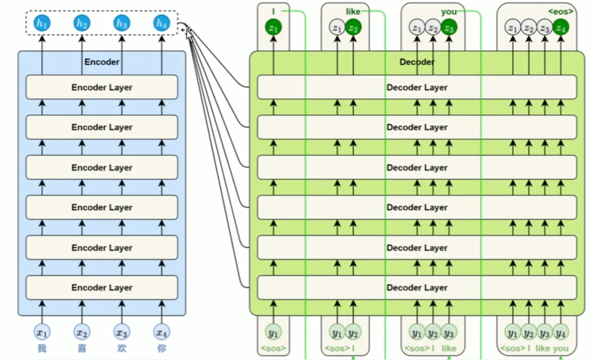

### 编码器(Encoder)

#### 概述
Transformer的编码器用于理解输入序列的语义信息，并生成每个token的上下文表示，为解码器生成目标序列提供基础。<br>
编码器由多个EncoderLayer组成。<br>
每个EncoderLayer的主要任务都是对其序列进行上下文建模，使每个位置的表示都能融合来自整个序列的全局信息。每个EncoderLayer都包含两个子层(sublayer),分别是自注意力子层(Slef-Attention Sublayer)和前馈神经网络子层(Feed-Forward Sublayer)。
 如下图所示:
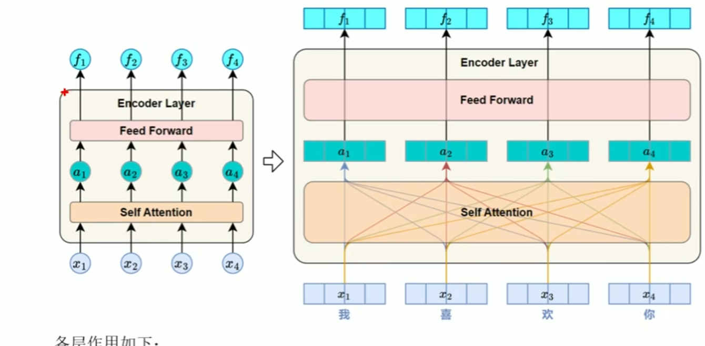

#### 自注意力子层

##### 概述
自注意力机制(Self-Attention)是Transformer编码器的核心结构之一，它的作用是在序列内部建立各位置之间的依赖关系，使得模型能够为每个位置生成融合全局信息的表示。<br>
之所以称之为自注意力机制，是因为模型在计算每个位置的表示时，所参考的信息全部来自同一个输入序列本身，而不是来自另一个序列。

##### 自注意力计算过程
-  生成Query,Key，Value向量<br>
自注意力的第一步，是将输入序列中的每个位置表示映射为三个不同的向量，分别是**查询(Query)**、**键(key)**、**值(value)**。
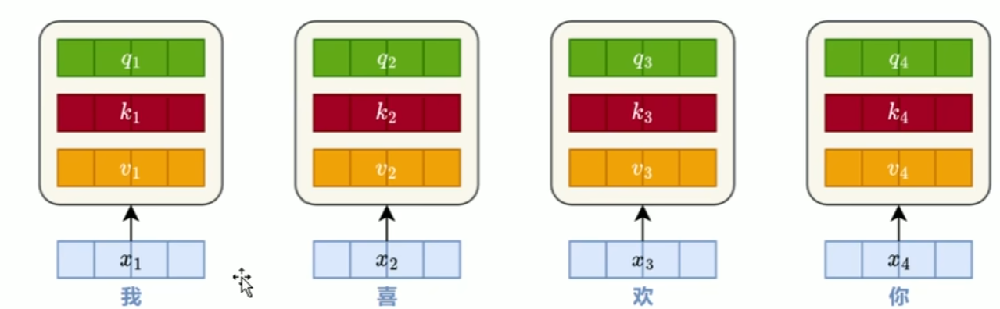
这些向量的作用如下:<br>
query向量: 用来查询当前位置的上下文信息，即查询当前位置的表示与哪些位置相关。<br>
key向量: 用来计算当前位置的上下文表示，即计算当前位置的表示与哪些位置相关,用于与query进行匹配。<br>
value向量:表示该位置携带的信息，用于加权汇总得到新的表示。<br>
我们用一个 图书馆找书 的比喻来解释，假设你要找“人工智能”相关的书：

- Q（Query，查询）：就是你脑海中的问题或需求——“我想要关于人工智能的书”。它是你寻找信息的线索。

- K（Key，键）：是每本书上贴的标签或简介，比如《机器学习》的标签是“技术/算法”，《三体》的标签是“科幻小说”。K 用来与 Q 做匹配。

- V（Value，值）：是书本身的实际内容。当你根据 Q 和 K 匹配找到最相关的书后，真正拿来阅读、获取信息的是 V。<br>
这三个向量也不是凭空生成的，而是通过计算获得的，计算方式如下:<br>
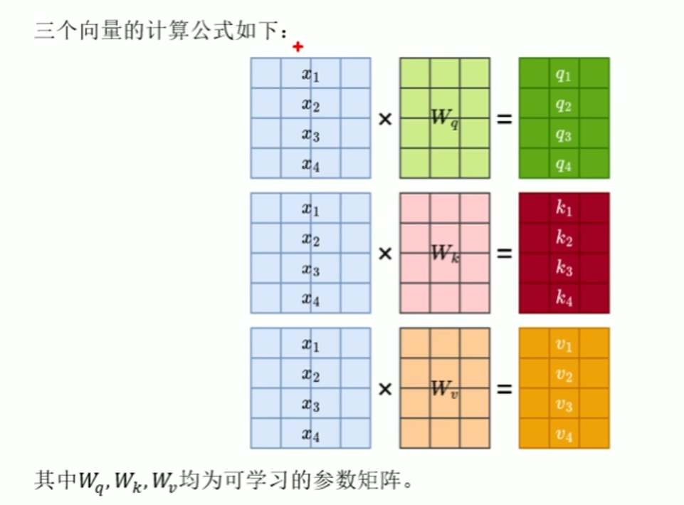
-  计算位置之间的相关性<br>
完成QKV生成之后，模型会使用每个位置的Q向量与所有位置的Key向量进行相关性评分。<br>
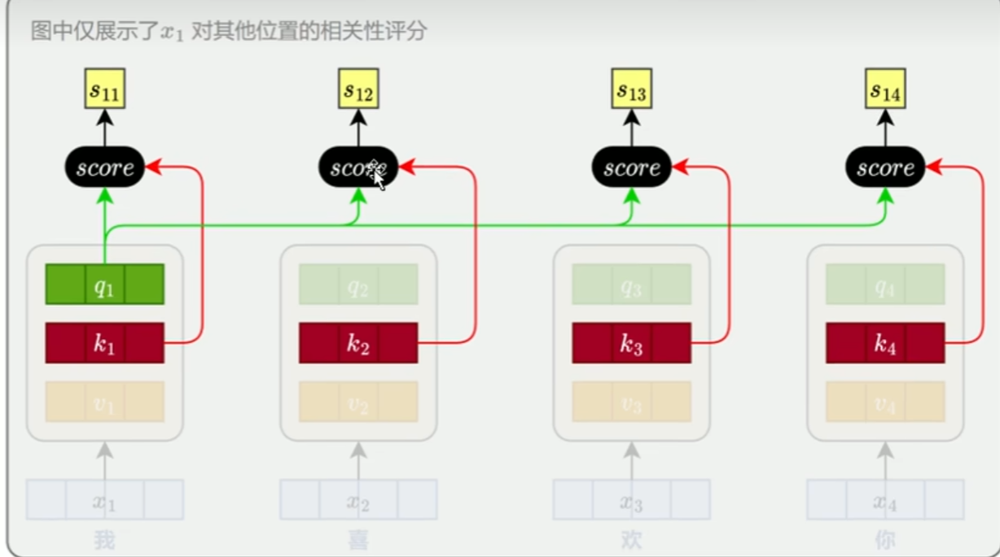
评分函数采用向量点积形式。由于在高维空间中，点积的数值可能过大，会影响softmax的稳定性，因此在实际计算中对结果进行了缩放。最终的评价函数为:
$$
socre(i,j)=\frac{q_i * k_j}{\sqrt{d_k }}
$$
除以$\sqrt{d_k}$的这个过程被称为**注意力缩放**。<br>
其中$d_k$是key向量的维度(这里为3)，用于缩放点积的幅度。这个分数越大，表示第$i$个位置越应该关注第$j$个位置的信息。

对于整个序列，可以通过矩阵运算一次性计算所有位置之间的评分，计算公式如下图所示:
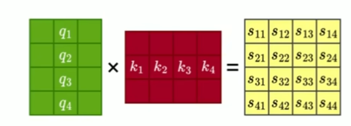
-  计算注意力权重
  
  在得到每个位置与所有位置之间的相关性评分后，模型会使用softmax函数进行归一化，确保每个位置对所有位置的关注程度之和为1。
  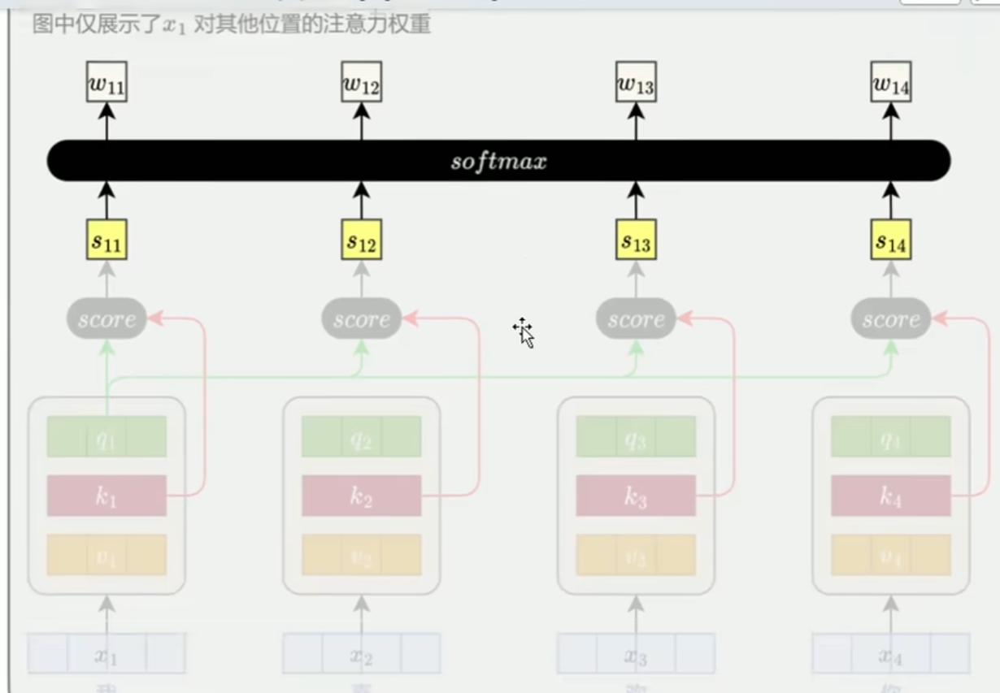
  对于整个序列，模型要做的是对之前得到的注意力评分矩阵的**每一行**进行softmax归一化。
  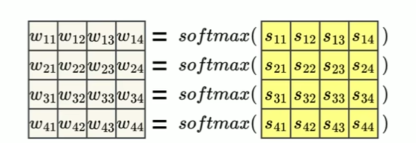
  
-  加权汇总生成输出<br>
  最后，模型会根据注意力权重对所有位置的Value向量进行加权求和，得到每个位置融合全局信息后的新表示。
  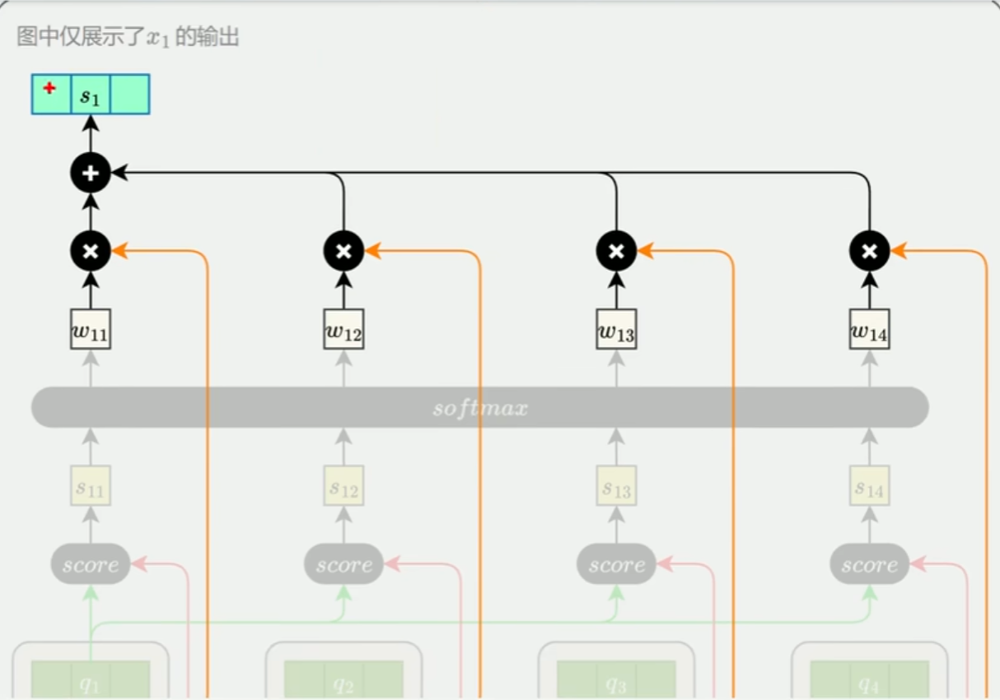
  对于整个序列，同样可以通过矩阵运算一次性计算所有位置的输出，如下图所示:
  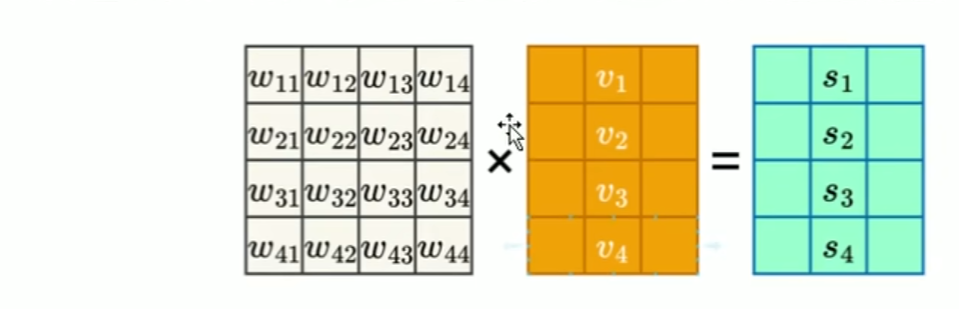

综上所述，可得整个自注意力机制的完整计算公式如下:
  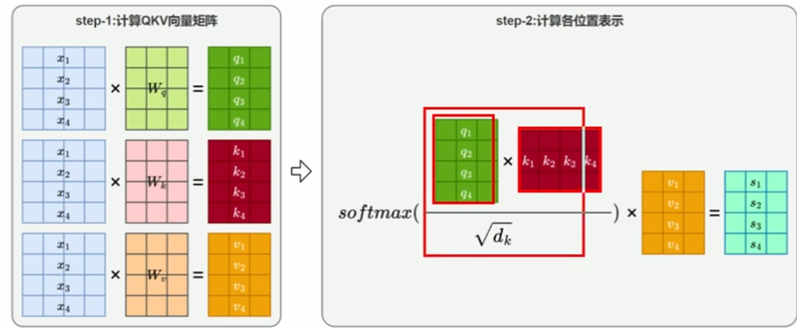
对应原始论文中的公式:
$$
Attention(Q,K,V)=softmax(\frac{QK^T}{\sqrt{d_k}})V
$$

##### 多头注意力计算过程
自注意力机制通过QKV向量计算每个位置与其他位置之间的依赖关系，使得模型能够有效捕捉序列中的全局信息。<br>
然而，自然语言本身具有高度的语义复杂性，一个句子往往同时包含多种类型的语义关系。<br>
要准确理解这类句子，模型需要同时识别并建模多种层次和类型的依赖关系。但这些信息很难通过单一视角或者一套注意力机制完整捕获。<br>
因此Transformer引入了**多头注意力机制(Multi-Head Attention)**。其核心思想是通过多组独立的的QKV，让不同注意力分别关注不同的语义关系，最后将各头的输出拼接融合。

- 先让每个Self-Attention Head 单独计算一套注意力输出。
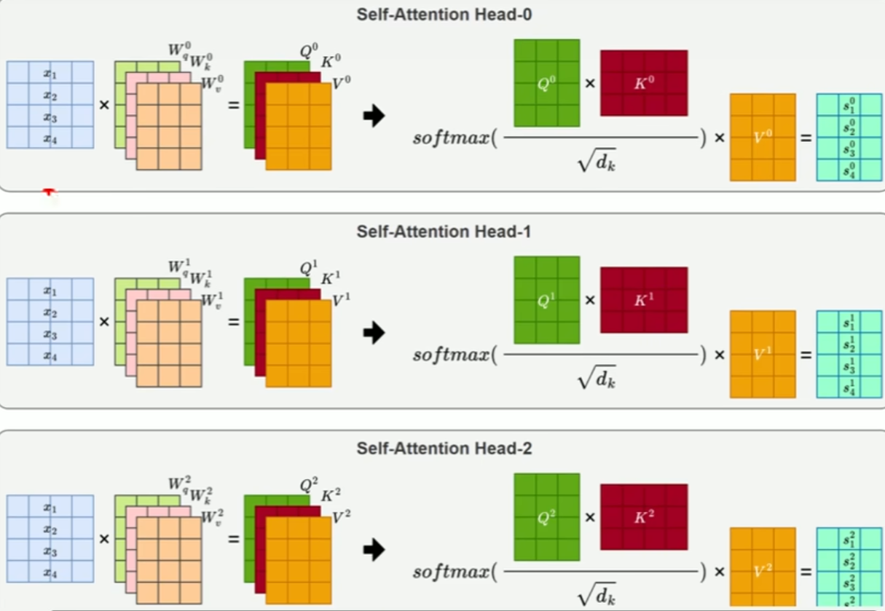

- 合并多头注意力<br>
  多个输出矩阵按维度拼接，再乘以$W_0$得到最终多头注意力的输出。
  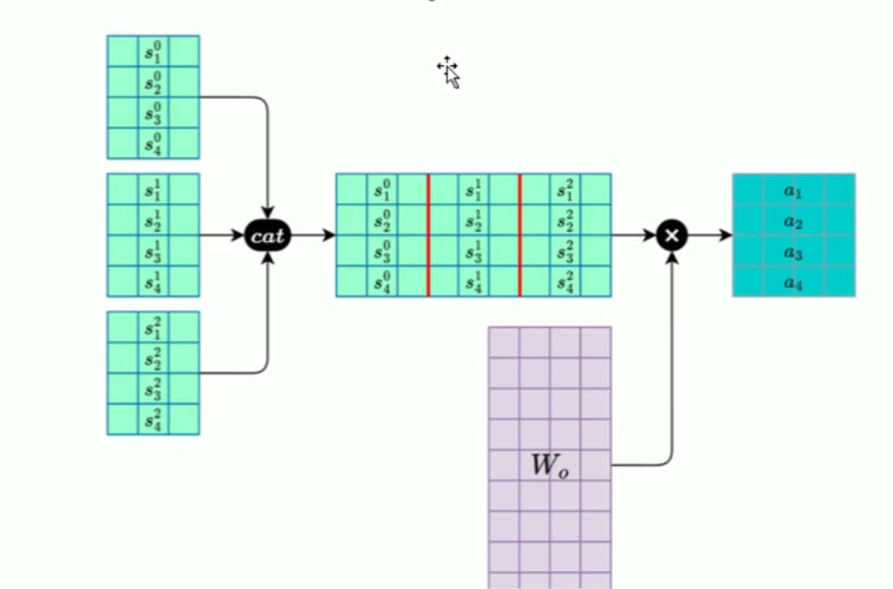

额外提一句，在原始论文中，多头注意力是有8头。

#### 前馈神经网络层
前馈神经网络(Feed-Forward Neural Network, FFN)是Transformer编码器每个子层的重要组成部分，紧接在多头注意力子层之后。它通过每个位置的表示进行逐位置、**非线性**的特征变换，进一步提升模型对复杂语义的建模能力。
一个标准的FFN子层包含两个线性变换和一个非线性激活函数，中间通常使用Relu激活函数。其计算公式如下:
$$
FFN(x) = Linear_2(Relu(Linear_1(x))) = W_2 \cdot Relu(W_1 \cdot x+b_1)+b_2
$$
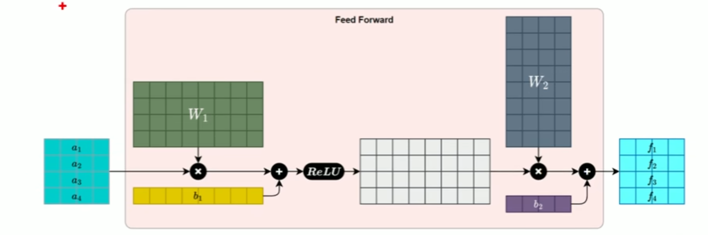

#### 残差连接与归一化
在Transformer的每个编码器层中，每个子层，包括自注意力子层和前馈神经网络子层，其输出都要经过**残差连接(Residual Connection)**和 **层归一化(Layer Normalization)**处理。这两者是深层神经网络中常用的结构，用于缓解模型训练中的梯度消失、收敛困难等问题，对于Transformer能够堆叠多层至关重要。如下图所示:
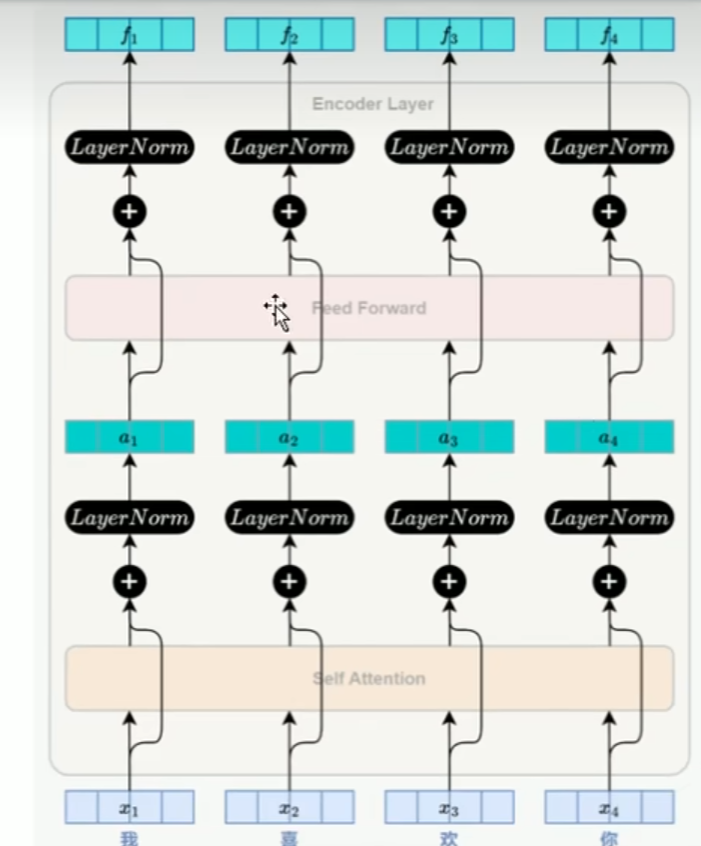

每个子层在残差连接之后都会进行一次层归一化，它的主要作用是规范输入序列中每个token的特征分布(某个token的表示可能在不同维度上有较大差异)，提升模型训练的稳定性。

层归一化会将每个向量都调整为均值为0，方差为1的规范分布，具体效果如下图所示:
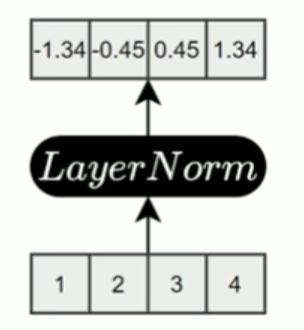
$$
\hat{x}=(x-u) / std
$$
让模型可以在学习归一化后的基础上进行适当调整，保证归一化不会限制模型表示能力。
$$
LayerNorm(x)=\gamma \cdot (x-mean) / std + \beta
$$
其中 $\gamma$ 和 $\beta$ 是可学习的参数


不过在这是 Vaswani 等人在《Attention Is All You Need》中提出的原始顺序,即**Post-LN**

```
子层输出 → Dropout → 残差连接（与输入相加）→ LayerNorm
```

但主流目前大多数主流模型（如 GPT-3、LLaMA、T5、ViT、DETR 等）都采用**Pre-LN**：

```
输入 → LayerNorm → 子层 → Dropout → 残差连接（与输入相加）
```

原始Transformer中，可以仍然时使用**Post-LN**，但在Transfomer的衍生模型(如VIT、DETR)中建议使用**Pre-LN**


#### 位置编码
Transformer模型完全摒弃了RNN结构，意味着它不再按顺序处理序列，而是可以并行处理所有位置的信息。尽管这样带来了显著的计算效率提升，却也引发了一个问题:Transformer无法像RNN那样天然捕捉词语之间的顺序关系。换句话说，在没有额外机会的情况下，模型无法捕捉到句子中词语之间的顺序关系。<br>
为了解决这一问题，Transformer引入了一个关键机制——**位置编码(Positional Encoding)**。该机制为每个词引入了一个表示其位置的向量，并将其与对应的词向量相加，作为模型输入的一部分。这样一来，模型在处理每个词时，既能获取词义信息，也能感知其在句子中的位置，从而具备对基本语序的理解能力。

大致的输入过程如下图所示：
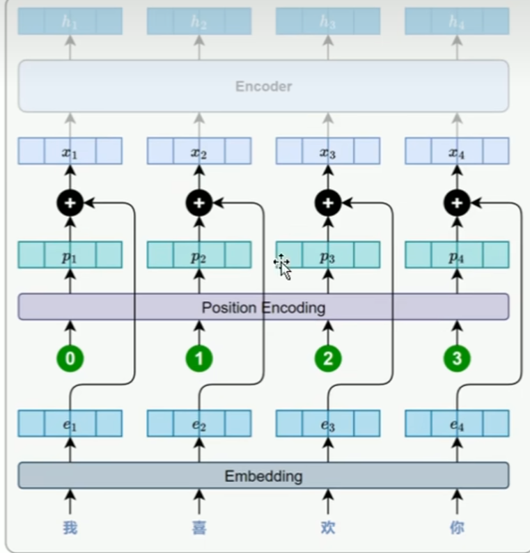
图中**Position Encoding**层就是用来处理位置信息的。把具体的位置如0、1、2、3等等编码成位置向量p1、p2、p3等。
Transformer使用了一种基于正弦(sin)与余弦(cos)函数的位置编码方式，具体定义如下:
$$
PE(pos,2i) =  \sin(pos/10000^\frac{2i}{d_{model}})
$$
$$
PE(pos,2i+1) = \cos(pos/10000^\frac{2i}{d_{model}})
$$
其中
- pos时当词在序列中的位置,如0、1、2、3等等
- $i$用于表示位置编码向量的维度索引，$2i$表示偶数维,$2i+1$表示奇数维
- $d_{model}$是词向量的维度大小,如512<br>
序列中每个位置$pos$对应一个长度为$d_{model}$的位置编码向量。该向量的**偶数维度**通过正弦函数生成，**奇数维度**通过余弦函数生成，如下图所示:
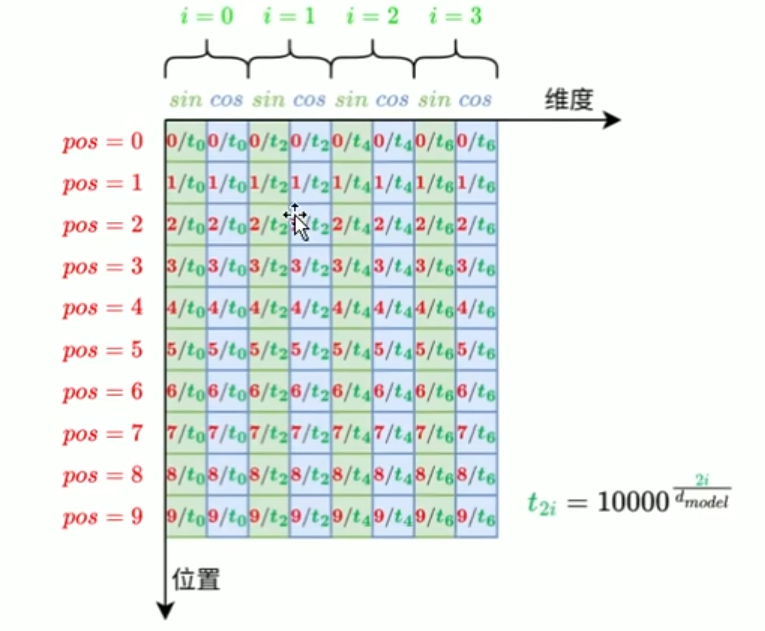

这种方式的优点有很多:
- 所有值都在[-1,1]之间，数值稳定
- **编码方式固定、可预计算，无需训练**
- 相同位置的编码在不同句子中保持一致
- 编码之间具有数学规律，便于模型在注意力机制中感知词语之间的相对位置关系

### 解码器(Decoder)

#### 概述
Transformer解码器的主要功能是:根据编码器的输出，逐步生成目标序列中的每一个词。在推理预测时，其生成方式采用**自回归生成(autoregressive)**:每一步的输入由此前已生成的**所有词组成**，**模型将输出一个与当前输入长度相同的序列表示**。我们只取最后一个位置的输出，作为当前步的预测结果。这一过程会不断重复，直到生成特殊的结束标记 \<eos> ,表示序列生成完成。
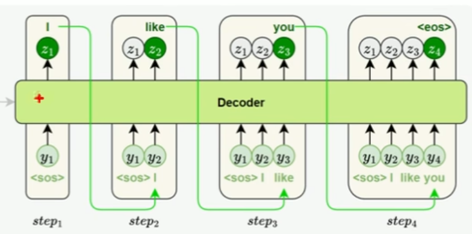


Decoder由多个DecoderLayer组成，每个DecoderLayer包含三个子层:
- Masked自注意力子层
- 编码器-解码器注意力子层(Encoder-Decoder Attention Sublayer)
- 前馈神经网络子层(Feed-Forward Network)
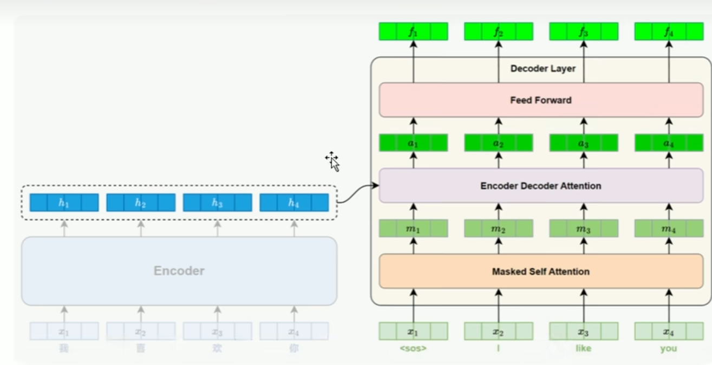
此外，解码器在输入端同样需要**位置编码(Positional Encoding)**,用于提供序列中的位置信息，其计算方式与编码器中相同。
在输出端，解码器的隐藏向量会送入一个线性层，映射为词表大小的向量，并通过Softmax生成一个概率分布，用于预测当前应输出的词。

#### masked自注意力子层
用于建模当前位置与前文词之间的依赖关系。为了在训练时模拟逐词生成的过程，引入遮盖机制,限制每个位置只能关注它前面的词。


Transformer在训练时，采用的输入输出方式与推理与预测阶段不同。
在训练阶段，通常采用**Shifted Right**输入方式，如假设我们有一个翻译任务：源语言"Hello" → 目标语言"你好"
- 目标真实序列：[\<sos>, 你, 好, \<eos>]

- 解码器输入：[\<sos>, 你, 好]（去掉最后一个\<eos>）

- 解码器输出（预测目标）：[你, 好, \<eos>]（对应输入的下一位置）如下图所示:
  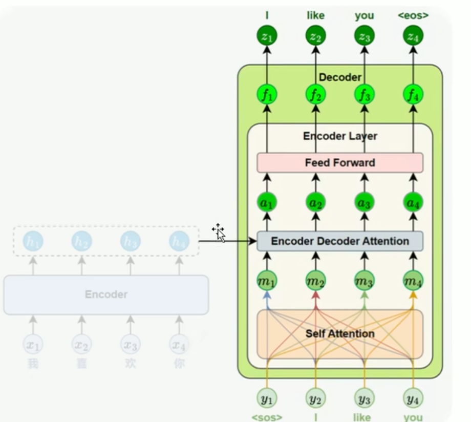
  Mask机制的实现非常简单：只需将注意力得分矩阵中**当前位置对其后续位置的评分设置为负无穷**即可。如下图所示:
  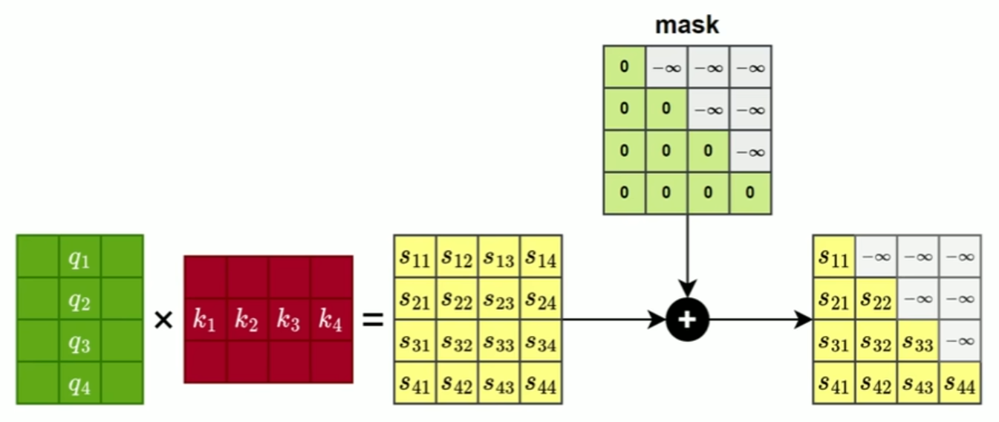
  这样，在经过softmax运算后，负无穷位置的权重会趋近于0。最终在加权求和时，来自未来位置的信息几乎不会参与计算，从而实现了**当前词只能看到它前面的词**。

  但在这一层中，对于不同的任务，其实也可以不要mask矩阵，不如DETR中，这一层就是普通的自注意层。翻译任务中，往往需要mask矩阵。


#### 编码器-解码器注意力子层
该子层的作用是:**建模当前的解码位置与源语言序列中各位置之间的依赖关系**，帮助模型在生成目标词时有效地参考输入内容，相当于Seq2Seq模型中的注意力机制。
编码器-解码器注意力的核心机制与前面见过的自注意力机制完全一致，区别仅在于:
- **query来自解码器的输出表示，即当前生成状态**
- **key和value来自编码器的输出表示，即整个源序列的上下文**<br>
也就是说，**当前生成位置使用自己的query，去询问编码器输出中的哪些位置最相关**。注意力机制会根据query和所有key的相似度，为每个源位置分配一个权重，然后用这些权重对value进行加权求和，得到当前生成词所需的上下文信息。

### 训练和推理机制

Transformer的训练和推理都基于**自回归生成机制(Autoregressive Generation)**:模型逐步生成目标序列中的每一个词。然而，在实现方式上，训练与推理存在明显区别。
#### 模型训练
训练时，Transformer 将目标序列整体输入解码器，并在每个位置同时进行预测。为防止模型“看到”
后面的词，破环因果顺序，解码器在自注意力子层引入了**遮盖(mask)**机制，限制每个位置只能关注它前面的词。<br>
训练采用**Shifted Right**机制，如下图所示:
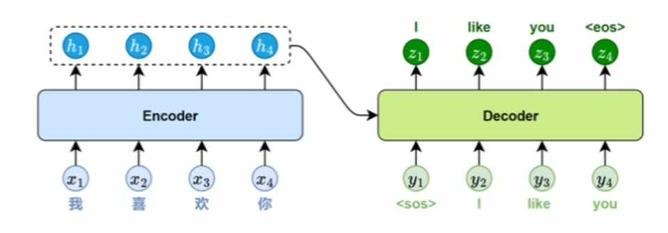
#### 模型推理
推理时，每一步都要重新输入整个已生成序列，模型需要基于全量前文重新计算注意力分布，决定下一个词的输出。整个过程必须顺序执行，无法并行。<br>
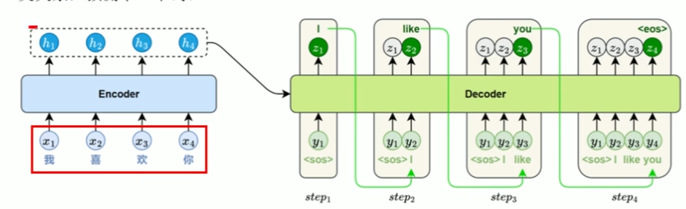
模型会基于**完整前文重新计算注意力分布**，生成当前步的输出。由于每一步的输入依赖前一步结果，整个过程必须**顺序进行，无法并行**

