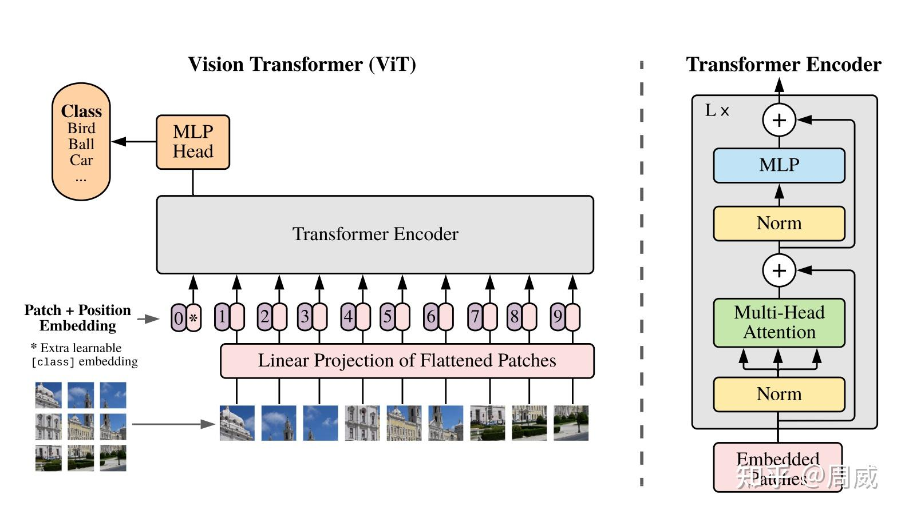

# VIT(Vision Transformer)

视觉 Transformer（ViT） 是深度学习领域一个里程碑式的架构，它开创性地将自然语言处理中大获成功的 Transformer 模型移植到了计算机视觉任务中。其核心理念可以概括为一句话：将一张图像视为由一系列图像块（Patches）组成的“句子”来处理。

它的出现，打破了卷积神经网络（CNN）在视觉领域长达十年的主导地位，证明了纯注意力机制在大规模数据上同样能成为视觉任务的有力骨干网络。

论文: [An Image is Worth 16x16 Words: Transformers for Image Recognition at Scale](https://arxiv.org/abs/2010.11929)
## VIT核心工作原理
ViT的整体流程大致可以分为四个步骤，它将二维图像巧妙地转换为一维序列，以适应Transformer的处理方式
1. **图像分块与序列化（Patch Embedding**：这是最关键的一步。ViT会将输入图像（例如 224x224x3）分割成一个个固定大小且互不重叠的方形小块（Patch），如经典的 16x16 大小。每个小块被展平成一个一维向量，并通过一个可训练的线性层投影，转换为维度统一的嵌入（Embedding）。这一步正如论文标题所言：“一张图片等于16x16个单词”
这一步主要是通过卷积来实现的，比如一个224*224*3 的图片，通过一个k=16,stride=16,out_channel=768的卷积后，变成一个14*14*768的特征图，则将通道数768看成词向量维度(word vector)，14*14=196看成序列长度(seq_len)就可以把图片当成序列数据进行处理了。
2. **添加分类标记（Class Token）**：得到图像序列数据(B, seq_len, embed_dim)后，ViT会在序列的开头添加一个特殊的分类标记（Class Token），这个标记的嵌入将作为整个图像的表示。
```python
self.cls_token = nn.Parameter(torch.zeros(1, 1, embed_dim))
......
cls_token =  self.cls_token.expand(x.shape[0], -1, -1) # cls_token.shape = [B,1,embed_dim]，扩展cls_token
x = torch.concat((cls_token, x), dim=1) # x.shape = [B,seq_len+1,embed_dim]
```
3. **添加位置编码（Positional Encoding）**：与处理文本序列类似，Transformer本身不包含空间顺序的概念。为了让模型知道各个图像块在原始图片中的位置，ViT为每个块的嵌入添加了一个可学习的“位置编码”。研究发现，即使是一维的位置编码，模型也能有效地学习到二维的空间结构
VIT中直接使用简单的可以直接训练的一维位置编码来
```python
pos_embed = nn.Parameter(torch.zeros(1, seq_len+1, embed_dim)) # 构建位置编码
......
x = x + pos_embed
```
4. **通过Transformer编码器**：得到的序列数据(B, seq_len+1, embed_dim)后，取出序列数据的第一个数据，即分类标记（Class Token），然后将这个分类标记放入分类头中既可以得到最终结果
```python
x = self.encoder(x) # x.shape = [B, seq_len+1, embed_dim]
out = x[:,0,:] # out.shape = [B,embed_dim]
out = self.head(out) # out.shape= [B,num_classes]
```
VIT整体架构如下图所示：


## 相关细节

### Post-LN与Pre-LN
Vaswani 等人在《Attention Is All You Need》中设计的原始Transofmer中，对于层归一化、残差连接、dropout和子层之间的执行顺序,遵循的是**Post-LN**，即
```text
输入 → 子层输出 → Dropout → 残差连接（与输入相加）→ LayerNorm
```
但主流目前大多数主流模型（如 GPT-3、LLaMA、T5、ViT、DETR 等）都采用**Pre-LN**：
```text
输入 → LayerNorm → 子层 → Dropout → 残差连接（与输入相加）
```
原始Transformer中，可以仍然时使用**Post-LN**，但在Transfomer的衍生模型(如VIT、DETR)中建议使用**Pre-LN**

### 位置编码
标准Transfromer中使用的位置编码是一种绝对位置编码，即二维正余弦位置编码，是通过数学公式计算出来，不参与学习的位置编码
而VIT中使用的是一种简单的一维可学习的位置编码

## 相关代码

### 多头自注意力层代码实现
```python
class Attention(nn.Module):
    """
    多头自注意力层
    用于构建Encoder
    """
    def __init__(self,
                 dim, # 输入词向量的维度
                 num_heads = 12, # 头数
                 qkv_bias = False, # 生成qkv时是否使用偏置
                 qkv_scale = True ,# 计算qkv分数时是否使用缩放
                 weight_dropout_ratio = 0.1, # 权重归一化后的dropout率
                 proj_dropout_ratio = 0.1 # 最后输出线性层的dropout率
                 ):
        super(Attention, self).__init__()
        self.num_heads = num_heads # 头数
        self.scale = (dim//num_heads) ** -0.5 if qkv_scale else 1.0 # 缩放参数,即Transformer论文中 sqrt(d_k)
        self.q = nn.Linear(dim, dim, bias=qkv_bias) # 用于生成q的线性层
        self.k = nn.Linear(dim, dim, bias=qkv_bias) # 用于生成k的线性层
        self.v = nn.Linear(dim, dim, bias=qkv_bias) # 用于生成v的线性层
        self.proj = nn.Linear(dim,dim)
        self.proj_drop = nn.Dropout(proj_dropout_ratio) if proj_dropout_ratio > 0 else nn.Identity()
        self.weight_drop = nn.Dropout(weight_dropout_ratio) if weight_dropout_ratio > 0 else nn.Identity()

    def forward(self,x):
        B,seq_len,dim = x.shape

        q = self.q(x) # q.shape = [B,seq_len,dim]
        k = self.k(x) # k.shape = [B,seq_len,dim]
        v = self.v(x) # v.shape = [B,seq_len,dim]

        q = torch.reshape(q, (B, seq_len, self.num_heads, dim // self.num_heads))
        k = torch.reshape(k, (B, seq_len, self.num_heads, dim // self.num_heads))
        v = torch.reshape(v, (B, seq_len, self.num_heads, dim // self.num_heads))

        q = torch.permute(q, (0, 2, 1, 3)) # q.shape = [B,num_heads,seq_len,dim//num_heads]
        k = torch.permute(k, (0, 2, 1, 3)) # k.shape = [B,num_heads,seq_len,dim//num_heads]
        v = torch.permute(v, (0, 2, 1, 3)) # v.shape = [B,num_heads,seq_len,dim//num_heads]

        score = q @ torch.transpose(k, -2, -1)  * self.scale # score.shape = [B,num_heads,seq_len,seq_len]

        weight = torch.softmax(score, dim=-1) # weight.shape = [B,num_heads,seq_len,seq_len],权重归一化
        weight = self.weight_drop(weight)

        attention = weight @ v # attention.shape = [B,num_heads,seq_len,dim//num_heads]
        attention = torch.transpose(attention, 1, 2) # attention.shape = [B,seq_len,num_heads,dim//num_heads]
        attention = torch.reshape(attention, (B, seq_len, dim)) # attention.shape = [B,seq_len,dim]
        attention = self.proj(attention) # attention.shape = [B,seq_len,dim]
        attention = self.proj_drop(attention) # attention.shape = [B,seq_len,dim]
        return attention
```

### MLP层(多层感知机，Transfromer原论文中称为前馈神经网络FNN)代码实现

```python
class Mlp(nn.Module):
    """
    前馈神经网络层(多层感知机),VIT论文中写的Mlp，所以这里就不写FFN了。实际上就是一个FFN
    线性层 + GELU激活函数 + dropout层 + 线性层
    用于构建Encoder
    """
    def __init__(self, in_features, hidden_features=None, out_features=None, dropout=0.1):
        super(Mlp, self).__init__()
        self.hidden_features = hidden_features or in_features
        self.out_features = out_features or in_features
        self.fc1 = nn.Linear(in_features, self.hidden_features)
        self.act = nn.GELU()
        self.fc2 = nn.Linear(self.hidden_features, self.out_features)
        self.dropout = nn.Dropout(dropout) if dropout > 0 else nn.Identity()

    def forward(self, x):
        x = self.fc1(x)
        x = self.act(x)
        x = self.dropout(x)
        x = self.fc2(x)
        return x
```

### PathchEmbeding层代码实现
```python
class PatchEmbedding(nn.Module):
    """
    将图像 patches 化为 token
    CIFAR-10 输入图像尺寸为 32x32
    通过PathEmbedding层 输出 序列长度(seq_len)为4,维度(word_vector)为256的序列数据
    """

    def __init__(self,patch_size = 16,embed_dim = 768):
        super(PatchEmbedding,self).__init__()
        # 运用卷积将图像变成序列数据,输出通道就是序列数据的向量维度，即词向量的维度
        self.proj = nn.Conv2d(3,embed_dim,kernel_size=patch_size,stride=patch_size)

        # 层归一化
        self.layer_norm = nn.LayerNorm(embed_dim)


    def forward(self,x):
        x = self.proj(x) # x.shape  = [B,embed_dim,H,W]
        x = torch.flatten(x,start_dim=-2) # x.shape = [B,embed_dim,seq_len]
        x = torch.permute(x, (0, 2, 1)) # x.shape = [B,seq_len,embed_dim] 调整维度顺序
        x = self.layer_norm(x)
        return x
```

### Encoder代码实现
```python
class Encoder(nn.Module):
    """
    一个Encoder
    由两个LayerNorm，一个自注意力层，两个个dropout，，一个MLP，和残差连接组成
    """
    def __init__(self,
                 dim, # 输入词向量的维度
                 num_heads = 12, # 自注意力层头数
                 qkv_bias = False, # 自注意力层生成qkv时是否使用偏置
                 qkv_scale = True ,# 自注意力层计算qkv分数时是否使用缩放
                 attn_weight_dropout_ratio = 0.1, # 自注意力层权重归一化后的dropout率
                 attn_proj_dropout_ratio = 0.1, # 自注意力层最后输出线性层的dropout率,
                 mlp_ratio=4,
                 mlp_drop_ratio=0.1,
                 encoder_dropout_ratio=0.1,
                ):
        super(Encoder, self).__init__()
        self.norm1 = nn.LayerNorm(dim)
        self.attention =Attention(dim, num_heads, qkv_bias, qkv_scale, attn_weight_dropout_ratio, attn_proj_dropout_ratio)
        self.dropout = nn.Dropout(encoder_dropout_ratio) if encoder_dropout_ratio > 0 else nn.Identity()
        self.norm2 = nn.LayerNorm(dim)
        self.mlp = Mlp(in_features=dim,hidden_features=dim*mlp_ratio,out_features=dim,dropout=mlp_drop_ratio)


    def forward(self,x):
        x_ = x
        x = self.norm1(x) # x.shape = [B,seq_len,dim]
        x = self.attention(x) # x.shape = [B,seq_len,dim]
        x = self.dropout(x) # x.shape = [B,seq_len,dim]
        x = x+x_


        x_ = x
        x = self.norm2(x) # x.shape = [B,seq_len,dim]
        x = self.mlp(x) # x.shape = [B,seq_len,dim]
        x = self.dropout(x) # x.shape = [B,seq_len,dim]
        x = x+x_


        return x
```

### VIT整体实现
```python
class VIT(nn.Module):
    def __init__(self, img_size = 224,patch_size=16, num_classes=1000,
                 embed_dim=768, depth=12, num_heads=8, mlp_ratio=4, qkv_bias=False, qkv_scale=True,
                 attn_weight_dropout_ratio=0.1, attn_proj_dropout_ratio=0.1, mlp_drop_ratio=0.1, encoder_dropout_ratio=0.1,pos_dropout_ratio=0.1):
        super(VIT, self).__init__()
        self.num_classes = num_classes # 分类数
        self.depth = depth # encoder的层数
        self.num_heads = num_heads # 子注意力层的头数
        self.seq_len = (img_size // patch_size) **2  # 不含位置编码和分类编码的序列长度

        self.patch_embedding = PatchEmbedding(patch_size, embed_dim)
        self.cls_token = nn.Parameter(torch.zeros(1, 1, embed_dim)) # 构建一个cls_token
        self.pos_embed = nn.Parameter(torch.zeros(1, self.seq_len+1, embed_dim)) # 构建位置编码
        # nn.Parameter() 表示将该张量作为可训练参数

        self.pos_dropout = nn.Dropout(pos_dropout_ratio)
        self.encoder = nn.Sequential(
            *[Encoder(embed_dim, num_heads, qkv_bias, qkv_scale, attn_weight_dropout_ratio, attn_proj_dropout_ratio, mlp_ratio, mlp_drop_ratio, encoder_dropout_ratio)
              for _ in range(depth)])
        self.norm = nn.LayerNorm(embed_dim)


        # 分类头
        self.head = nn.Linear(embed_dim, num_classes)

        # 使用截断正态分布初始化cls_token和位置编码，这是标准做法
        nn.init.trunc_normal_(self.cls_token, std=0.02)
        nn.init.trunc_normal_(self.pos_embed, std=0.02)
        self.apply(self._init_vit_weights)


    @classmethod
    def _init_vit_weights(cls,m):
        """
        ViT 权重初始化函数
        通过 models.apply(_init_vit_weights) 遍历所有子模块
        """
        if isinstance(m, nn.Linear):
            # 线性层：截断正态分布初始化，std=0.02
            nn.init.trunc_normal_(m.weight, std=0.02)
            if m.bias is not None:
                nn.init.constant_(m.bias, 0)  # 偏置初始化为0

        elif isinstance(m, nn.Conv2d):
            # 卷积层：截断正态分布初始化
            nn.init.trunc_normal_(m.weight, std=0.02)
            if m.bias is not None:
                nn.init.constant_(m.bias, 0)

        elif isinstance(m, nn.LayerNorm):
            # LayerNorm：权重初始化为1，偏置初始化为0
            nn.init.constant_(m.weight, 1.0)
            nn.init.constant_(m.bias, 0)

    def forward_feature(self,x):
        # x.shape = [B,3,224,224]

        x = self.patch_embedding(x) # x.shape = [B,seq_len,embed_dim]
        cls_token =  self.cls_token.expand(x.shape[0], -1, -1) # cls_token.shape = [B,1,embed_dim]，扩展cls_token
        x = torch.concat((cls_token, x), dim=1) # x.shape = [B,seq_len+1,embed_dim]
        x = x + self.pos_embed # x.shape = [B,seq_len+1,embed_dim],这里相加pos_embed时，pos_embed会自动广播
        x = self.pos_dropout(x)
        x = self.encoder(x)
        x = self.norm(x)

        return x[:,0] # 返回cls_token，即分类编码 [B,embed_dim]

    def forward(self,x):
        # x.shape = [B,3,224,224]

        x = self.forward_feature(x) # x.shape = [B,embed_dim]
        x = self.head(x) # x.shape = [B,num_classes]
        return x
```